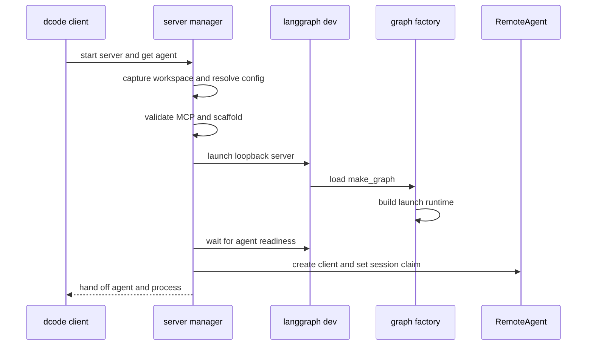
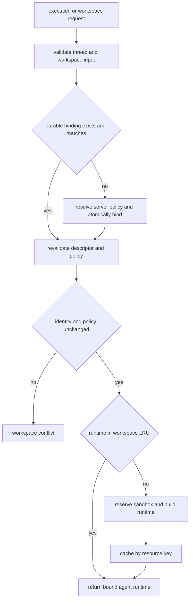
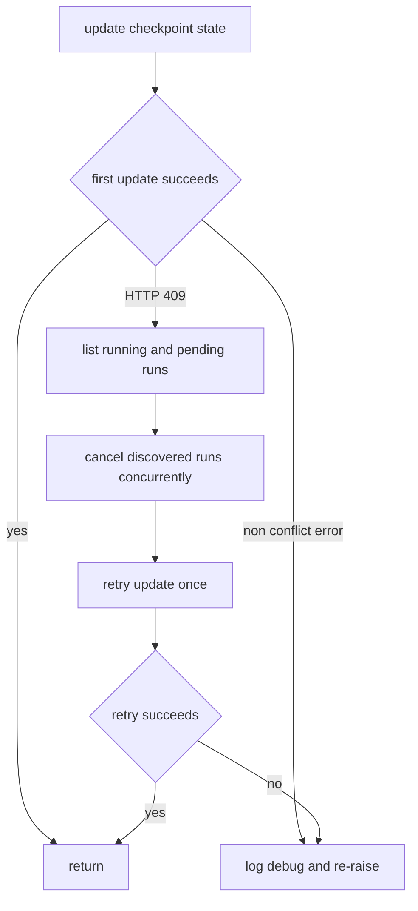

# dcode Runtime Behavior and Failure Handling

Interactive dcode is split across a client/UI process and an owned loopback `langgraph dev` server. The client uses `RemoteAgent` for HTTP and SSE; the server owns graph construction, backends, sandbox and MCP lifetime, durable workspace routing, and the `/offload` operation. This boundary is intentional: a client supplies a request and a constrained session claim, but cannot choose another project's execution policy or make server credentials use a client-selected transport. See [Deep Agents Code Architecture](/openwiki/architecture/code-agent.md), [Configuration Layering](/openwiki/concepts/config-layering.md), [Permissions and HITL](/openwiki/concepts/permissions-hitl.md), [State Persistence](/openwiki/concepts/state-persistence.md), [Security](/openwiki/operations/security.md), and [Run a dcode session](/openwiki/workflows/run-dcode-session.md).

## Startup and ownership

`start_server_and_get_agent` captures the workspace, resolves `ServerConfig`, pre-validates an explicit MCP configuration, serializes the config into `DEEPAGENTS_CODE_SERVER_*`, and scaffolds a temporary server project. It starts on `127.0.0.1` with ephemeral port `0` by default, waits for the `agent` graph, then configures `RemoteAgent` with the workspace's session-only policy claim and fingerprint. Until this handoff succeeds, the manager owns the child; its `finally` stops it on every failed path, including cancellation.

This sequence shows that the process becomes caller-owned only after graph readiness and remote-client configuration succeed.

`ServerConfig` is the shared process-boundary schema: the parent writes it with `to_env()` and the server reconstructs it with `from_env()`. It includes model settings, interaction/tool choices, sandbox and MCP choices, extensions, and project context. Its workspace payload deliberately partitions policy:

- **Session policy** is claimable by the managed client and includes controls such as `auto_approve`, shell and filesystem restrictions, and feature enablement.
- **Project policy**—MCP configuration/trust, sandbox setup, extension paths and extension trust—is resolved by the server for the target directory. It is never accepted just because the client named it.

This prevents checkout-scoped code execution grants from leaking from the launch project into another workspace. Filesystem allowlists are also fail-closed: malformed, empty, or unknown environment values are rejected, and an explicit list must contain `read_file`.

## Workspace and thread lifecycle

A workspace binding is a server-authoritative SQLite row keyed by thread ID. It persists canonical `cwd`, project root, workspace identity, a policy fingerprint/resource key, and non-secret resource policy. Paths must be existing absolute directories without traversal; the client payload is only runtime context and is checked against this durable record. A first-bind race has one winner, and the same binding is idempotent.

The `/dcode/threads/{thread_id}/workspace` route resolves the requested directory, resolves trusted policy for it, rejects unknown request fields, project-policy claims, and mismatched session claims, then persists the binding unless `validate_only` is requested. It builds the selected runtime before mirroring workspace metadata into the HTTP thread row. Thus validation errors are distinguishable from runtime unavailability: malformed input is `422`, policy/binding conflicts are `409`, and a construction failure contained in request scope is `503`. Metadata-mirroring failure occurs after the durable bind and is reported as `503`; callers must not assume an HTTP row was updated merely because binding persistence succeeded.

`RemoteAgent` keeps its configuration policy separate from its per-thread descriptor cache. `set_workspace` requires policy and fingerprint together and clears cached descriptors. The first stream or operation for a thread posts `cwd` plus the optional session claim to the workspace route, validates the descriptor/MCP metadata response, and caches it per thread. `aswitch_workspace(..., validate_only=True)` does not mutate that cache; a failed actual switch leaves the prior client workspace state intact. The cache reduces binding requests only—it is not authorization.

This flow separates a client cache from durable binding and server-side runtime selection.

For context-bearing graph execution, `make_graph` requires a nonempty thread ID and workspace context, validates it with `require_thread_workspace`, and selects the bound runtime. Calls without execution context return the configured launch runtime. Before every reuse or build, the server re-resolves policy and rejects project-policy or full-fingerprint drift. It preserves an already-bound denial when extension trust is newly granted, but revocation remains visible; a trust-store read failure is conservatively treated as drift. This means a cached runtime is not permission to continue after policy changed.

The launch runtime is lock-protected and cached. Workspace runtimes are a second lock-protected LRU, keyed by the binding resource key and capped at 32 entries. Construction is not a harmless optimization: it opens resources and establishes the backend shared by the graph and offload route. A configured sandbox is process-lifetime state and may be claimed by only one workspace ID, including when that first workspace build later fails; another workspace is refused rather than silently sharing it. Process-wide LangSmith tracing settings are likewise reserved for the process lifetime, so incompatible workspace tracing requires a separate server.

## Remote streams, state, and recovery

`RemoteAgent` is a thin adapter over `RemoteGraph`. It requires `config.configurable.thread_id`, gets that thread's workspace descriptor, forwards it through runtime context, and delegates SSE parsing, `messages-tuple` negotiation, namespace extraction, and interrupt detection to `RemoteGraph`. It requests `messages` and `updates` by default, converts streamed message dictionaries and `__interrupt__` updates for the Textual UI, but deliberately leaves state snapshots serialized. Message conversion failures are logged and counted after the stream rather than aborting unrelated events. Tool-message `additional_kwargs` survive conversion so server-side markers such as automatic denials reach the UI.

Checkpoint persistence and the development server's live HTTP thread rows are separate. `aget_state` treats a missing remote thread and the SDK's known no-checkpoint `TypeError` shape as empty state, but logs and re-raises network, authentication, server, and other state-shape failures. `aensure_thread` idempotently registers the HTTP row with `if_exists="do_nothing"`; this allows a persisted thread to accept mutations after a server restart. It does not reset an error status.

State updates distinguish a recoverable busy-thread conflict from other failures. On one HTTP `409`, `aupdate_state` lists `running` and `pending` runs, cancels discovered runs concurrently with `wait=True` and `action="interrupt"`, bounds each wait at 10 seconds, and retries the update once. Individual listing/cancellation failures are best effort and logged; the final retry still surfaces its exception. Non-conflict update failures are re-raised immediately.

This is a bounded recovery attempt, not a guarantee that an unreachable or still-active server run has stopped.

`aabandon_pending_work` deliberately discards, rather than resumes, stale graph work. It cancels active runs, adds error `ToolMessage` results only for unanswered calls in the trailing AI-message turn, writes `__end__`, then rereads state and raises if queued nodes, tasks, or interrupts remain. The trailing-turn restriction preserves provider-required tool-use/result adjacency; older interrupted calls can intentionally remain dangling.

## Approval-mode persistence fails closed

Interactive approval mode is live server state, not merely a UI flag. The client derives a deterministic hashed store key from the thread ID and writes `{"mode": "manual" | "auto" | "yolo"}` to `("deepagents_code", "approval_mode")`. The server validates that a supplied key belongs to the active thread, reads the record asynchronously in `AsyncApprovalHITLMiddleware` after model completion, and routes gated tools accordingly. Missing, malformed, unreadable, or unavailable records resolve to Manual; typed Auto and YOLO context without a valid live key also resolves to Manual. A private in-process routing marker prevents checkpointed state or graph input from forging an autonomous decision.

A RemoteAgent store-write failure is intentionally re-raised. At turn start, the Textual adapter first tries to persist the selected mode; if that fails, it tries to persist Manual. If Manual cannot be persisted too, it removes the approval key, updates local state to Manual, and blocks graph execution. During an already live session, a failed Auto or YOLO write leaves the current mode unchanged; a failed Manual write blocks new runs and interrupts active work. This avoids a stale live key continuing to auto-approve after the UI believes it has returned to Manual.

The installation-local `approval.json` serves a different purpose: it records the YOLO acknowledgement and the Auto education notice, not live routing. Read/parse corruption is logged and treated as empty. Saves use a process-local lock plus cross-process `FileLock`, private directory/file modes, read-merge-write, and atomic replacement so the two records do not clobber each other. A failed notice save is recoverable (the notice can be shown again), whereas a missing YOLO acknowledgement prevents entering YOLO.

## Server-owned offload and construction failures

Offload is an authenticated custom HTTP operation backed by the same `ServerRuntime` as the agent, rather than a second graph. Runtime construction returns the compiled agent, its `CompositeBackend`, and an offload operation derived from that exact backend; missing that operation is a construction failure. The client ensures the thread row, forwards the bound workspace descriptor, validates result shape, and converts a missing route into a compatibility error. Cancellation waits for server acknowledgement before propagating client cancellation.

The operation validates its narrow JSON contract and workspace binding, reads and hydrates checkpoint state itself, refuses active/pending/non-quiescent threads, and uses a per-thread lock. It takes model identity from the checkpoint and strips client endpoint/proxy/transport parameters: a local loopback client must not direct credentialed server model traffic. It writes only channels declared by `OffloadStateUpdate` and rejects `messages` writes, preventing an out-of-band operation from clobbering conversation history. A hook interrupt returns resumable work; each resume reruns the operation and replays already supplied hook responses using a stable operation ID.

`409` means no offload state was committed; `422` means nothing ran; `503` means no runtime could be built; and `500` is either an unexpected fault or explicitly indeterminate commit status. In the indeterminate case a checkpoint write failed but a follow-up read found the thread advanced, so the caller must surface the response rather than claim success or safe retry.

At construction, the server snapshots workspace environment and credentials before runtime assembly, moves blocking setup off the event loop, creates conditional built-in/web/MCP tools, and only gives criteria/rubric agents exact read-only built-ins plus coherently annotated read-only MCP tools. Sandboxes live until process cleanup; unsupported or failed creation emits `DEEPAGENTS_STARTUP_ERROR:` and exits. Experimental extension load failures are warnings, while active extensions are shut down if later construction fails and at custom-app lifespan teardown.

The graph-factory startup barrier emits the marker and exits nonzero on managed-config or runtime construction failure, which lets parent readiness polling report the cause. Request-scoped custom routes contain `SystemExit` and return `503` instead of terminating an already-serving process. Server startup strips `PYTHONPATH`; it carries the inherited value only through a dedicated variable for downstream approval-gated execute commands. Local launch uses noop auth; generated custom routes opt into configured deployment auth.

## Retry, shutdown, and regression focus

`CodeModelRetryMiddleware` wraps model-node calls, not an entire agent turn, and is installed inside compaction. It reads request-time model retry budget when present, lets `GraphBubbleUp` pass through, retries only classified transient failures while budget remains, honors usable `Retry-After` or jittered exponential backoff, and re-raises terminal failures. It emits correlated attempt/retry events and reports event-emission failure without failing the run, so consumers can mark potentially visible partial output as incomplete.

`ServerProcess` owns child shutdown. POSIX uses a dedicated process group for group `SIGTERM`, wait, then `SIGKILL` escalation while refusing to signal dcode's own group. Windows uses Ctrl+Break then root-process termination; descendants can survive as orphans. These limitations matter when operating long-running shell tools.

Focused tests cover RemoteAgent conversion, empty-state distinctions, conflict recovery, binding/switch behavior, recovery cleanup, store-write propagation, and offload cancellation/protocol handling. Workspace and server-graph tests cover atomic durable binding, schema migration, project-policy and trust drift, runtime cache/locking, process-wide sandbox ownership, startup-marker containment, and event-loop-safe construction. Approval tests cover fail-closed Store reads and UI behavior when live writes fail.

When changing this area, preserve these boundaries:

1. Bind and verify the workspace before selecting a runtime; do not elevate the RemoteAgent cache into authority.
2. Keep project-scoped execution grants server-resolved and revalidate cached runtimes for drift.
3. Keep server graph and `/offload` on the same backend, and keep offload checkpoint writes narrowly allowlisted.
4. Preserve the distinction between recoverable `409` retry behavior and propagated state/Store failures.
5. Never let a failed live approval persistence leave Auto or YOLO effective; inability to persist Manual blocks work.
6. Retain startup-marker parsing, request-scope `SystemExit` containment, cancellation-safe launch cleanup, and platform-specific process shutdown behavior.
