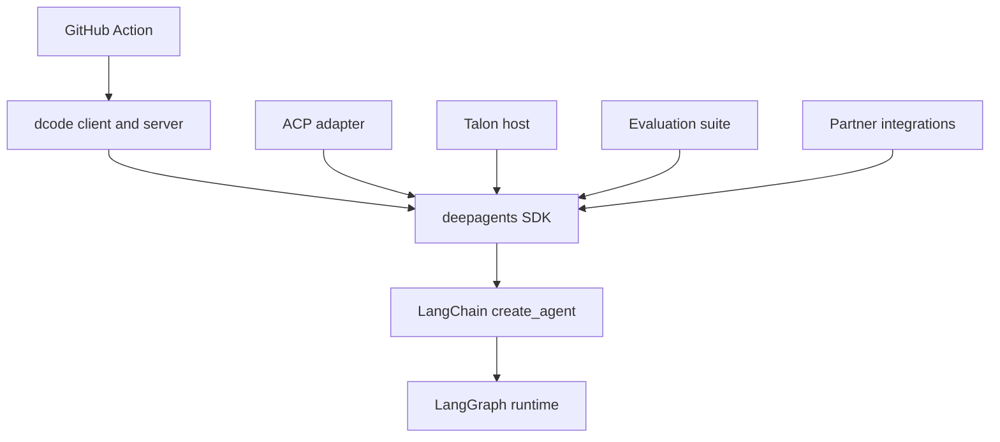
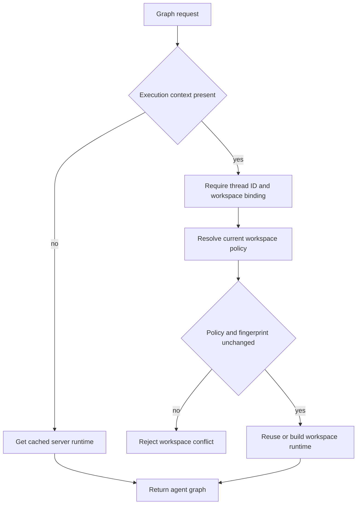

# Source Map and Change Routing

Start with the observable contract—an SDK import, command, protocol operation, Action input, or released package—then trace to the assembly or lifecycle owner. This page complements the [architecture overview](/openwiki/architecture/overview.md), [SDK construction and execution guide](/openwiki/architecture/sdk-construction-execution.md), [code-agent map](/openwiki/architecture/code-agent.md), [Talon integration guide](/openwiki/integrations/talon.md), [development guide](/openwiki/operations/development.md), [quickstart](/openwiki/quickstart.md), and [testing guide](/openwiki/testing/testing-guide.md).

## Boundaries that determine ownership

`libs/` is a monorepo of independently versioned packages. Work inside the package being changed: it owns its `pyproject.toml`, `Makefile`, README, environment, and tests; local dependencies are editable for sibling consumers. Use `make help` in that package, and use the fan-out targets from `libs/` only for repository-wide checks. The release manifest currently tracks the SDK, ACP, dcode, Talon, and five partner packages; `evals` is not in that manifest.

This shows dependency and responsibility direction: generic agent policy belongs in the SDK, while terminal presentation, ACP translation, host lifecycle, evaluation, vendor integration, and CI orchestration belong to their consuming surface.

## Change-routing table

| Intended behavior change | Owning package and public surface | Follow the seam | Focused validation and release boundary |
| --- | --- | --- | --- |
| Build an agent or change default tools, backend, prompt, subagents, middleware, persistence, or interrupts | `libs/deepagents`; `deepagents` and `create_deep_agent()` | Start at `deepagents/graph.py:create_deep_agent()`. It resolves model and profiles, backend, middleware, subagents, and prompt before it calls LangChain. Provider profiles own model construction; harness profiles own the built agent's runtime shape. | Start with `tests/unit_tests/test_graph.py`, then the closest backend, middleware, or profile test. This is the SDK release boundary. |
| Change a supported SDK import | `libs/deepagents`; `deepagents/__init__.py` | Re-export only supported API, then trace the export to its implementation and users. | Test observable import and compatibility behavior. SDK release boundary applies. |
| Change terminal arguments, startup, presentation, input, or headless behavior | `libs/code`; `dcode` and `deepagents-code` | Both commands resolve `deepagents_code:cli_main` lazily. Follow `main.py` for command lifecycle, client code for presentation/input, and server code for agent runtime. | Start in the nearest `libs/code/tests/unit_tests/` command, client, or app test. dcode is release-managed. |
| Change dcode agent composition, server configuration, MCP, sandboxing, workspace routing, or offload | `libs/code`; server graph/config boundary | Follow `ServerConfig.to_env()` / `from_env()`, then `server_graph.py:make_graph()` and the runtime factories. A server execution request needs a thread ID and workspace context; bound policy or configuration drift is rejected. | Use `test_server_config.py`, `test_server_graph.py`, plus the closest MCP, sandbox, workspace, or offload test. Preserve runtime caching and startup-failure handling. |
| Change ACP sessions, streamed updates, approval behavior, or ACP model/mode options | `libs/acp`; `AgentServerACP` | `deepagents_acp/server.py` adapts ACP sessions and content to a compiled Deep Agent. Durable loading is opt-in and checks the session's original working directory before replay. | Start with `tests/test_agent.py`; use command-allowlist, dangerous-pattern, model-switching, or module-entrypoint tests as appropriate. ACP is release-managed. |
| Change long-running channels, cron, persistence, MCP management, or Talon CLI lifecycle | `libs/talon`; `deepagents-talon` and `deepagents_talon` | `__main__.py` loads config and persistent cron storage, selects channels, builds a runtime, and drives `TalonHost`. No configured model deliberately selects the echo runtime. | Start with `test_main.py`, `test_host.py`, `test_runtime.py`, or `test_data_lifecycle.py`; use `channels/`, `cron/`, MCP, history, or integration tests for that boundary. Talon is release-managed. |
| Measure a real-model behavioral regression | `libs/evals`; `deepagents-evals` | The CLI owns one-run and repeated trials, report aggregation, charts, catalog/model-group generation, and discovery. | Add deterministic regression coverage in the owner first; add an eval when trajectory is the actual contract. Evals has a console script but is not release-please managed. |
| Add or change a vendor backend/integration | `libs/partners/<partner>` | Keep vendor-specific behavior in the partner package and preserve the SDK-facing contract. | Package tests alone are insufficient: wire CI, release/change detection, labels, secrets, and Harbor/integration workflows where applicable. Listed partners are separately release-managed. |
| Change GitHub workflow automation around dcode | repository root; `action.yml` | Treat Action inputs and outputs as workflow API. Map a changed input to the invoked dcode flag and validate before execution. | Exercise the relevant workflow scenario. The Action installs dcode separately, so pinned CLI versions can lack newer optional flags. |

## Core SDK: assembly, profiles, and exports

The `deepagents` root is the supported import boundary. It re-exports `create_deep_agent`, `DeepAgentState`, middleware and subagent types, and profile registration helpers. `create_deep_agent()` is the harness assembly point: it resolves model/profile and backend, constructs default and supplied subagents and the middleware stack, composes prompt content, and delegates to LangChain's `create_agent()`.

Route a fix by layer: Deep Agents owns opinionated defaults, middleware, backends, and profiles; LangChain owns the general agent loop; LangGraph owns state, checkpoints, streaming, and interrupts. Provider profiles control model construction, including `init_chat_model` arguments and pre-initialization side effects. Harness profiles shape the post-construction runtime—prompt, tool visibility, middleware, and default subagents. Profile registrations for a provider or `provider:model` key merge with prior registration rather than replace it. Built-in profiles and third-party profile plugins are loaded lazily at first registry access.

Do not remove `FilesystemMiddleware` or `SubAgentMiddleware` through profile exclusions: they are required scaffolding for built-in file-tool permissions and the `task` handler, and the SDK raises `ValueError` rather than build a silently degraded agent.

## dcode: process boundary, lifecycle, and workspace policy

`deepagents-code` is a prebuilt terminal coding agent implemented as a terminal client and agent-server process joined by streaming. The client owns display, input, and approvals; the server owns graph construction, model/tools/memory/skills/backend integration, streaming, checkpoints, and resume. `deepagents_code:cli_main` is lazy, so importing ordinary package submodules does not load `main.py` startup machinery.

The server's central control flow is:

This shows how `make_graph()` selects a graph and refuses an invalid or drifted workspace binding.

`ServerConfig.from_env()` reconstructs the environment produced by `ServerConfig.to_env()`. For a different project, `resolve_workspace()` drops launch-project MCP and sandbox setup rather than reusing policy from a potentially untrusted checkout; it also re-reads extension trust. For a bound workspace, server-side resolution rejects changed project policy or configuration fingerprint. A process-wide sandbox can only be claimed by one workspace, and workspace runtimes are bounded in an LRU cache.

Runtime caching is a correctness constraint, not a speed optimization: the interactive graph and offload routes share one agent, backend, and offload operation. Reconstructing them would repeat MCP discovery, leak sandbox sessions, and register duplicate exit handlers. MCP discovery runs asynchronously through a process-wide manager tied to the server event loop. Configuration, sandbox, or construction failure emits a machine-readable startup error before exit, enabling the parent process to diagnose startup rather than continue with partial resources.

## ACP: translation and persistence condition

`AgentServerACP` is the protocol adapter rather than a second SDK-policy layer. It owns session working directories and options, translates ACP content into LangChain content, invokes the compiled graph, and streams graph events and interruptions back as ACP updates.

`session/load` is unavailable unless session loading is enabled and the graph has a durable checkpointer. A load restores the LangGraph thread, verifies persisted ACP metadata and that the requested working directory equals the session's original directory, restores options when available, and replays the conversation. `python -m deepagents_acp` runs the asyncio test server; production code builds an adapter around an agent and serves it through ACP's `run_agent` API.

## Talon: lifecycle owner, not a security boundary

The `deepagents-talon` distribution installs `deepagents-talon`, while its package root exposes configuration, host, channel/interface, cron, and speech types and lazy-loads runtime classes. Its CLI reads `TalonConfig`, handles `import-fleet` and MCP management commands before host startup, creates persistent cron storage, ensures the home directory, cleans sensitive state, selects requested channels, and runs the host.

For host startup, an unset model selects `EchoAgentRuntime`. With a model, Talon uses a supplied checkpointer or opens SQLite checkpoints and history and wraps them in `ConversationSaver`; it loads MCP tools and constructs `DeepAgentRuntime`. A persistent scheduler exists only when channels exist. `--once` starts then stops after bootstrap; otherwise the host runs until stopped.

Talon is explicitly experimental and alpha-status. It does not provide production-grade complete approval policy, channel administrator controls, sandbox-backed execution isolation, or multi-tenant boundaries; channel access must be treated as access to the operator's agent, credentials, tools, and host resources. Do not represent it as an isolation boundary when adding channels or tools.

## Evals, partners, releases, and the GitHub Action

`deepagents-evals` supplies the `deepagents-evals` CLI for `run`, `trials`, `aggregate`, `radar`, `catalog`, `model-groups`, and `list`. JSON and dry-run output serve automation; exit code `1` reports evaluation failures, `2` configuration or generated-file drift, and `3` no usable reports. This makes it the owner for evaluation orchestration, not a replacement for focused deterministic tests.

Partner packages are independently versioned and own their own environments and tests. Adding a package also requires repository-level issue areas, labeling, dependabot, CI/change detection, scopes, release workflow/detection and release configuration/manifest entries, release notes mapping, secret inventory, and relevant sandbox and integration-test wiring. Set a first release-please manifest baseline to `0.0.0`.

The release manifest currently contains: `libs/deepagents` `0.7.13`, `libs/acp` `0.0.11`, `libs/code` `0.1.68`, `libs/talon` `0.0.8`, and Daytona, Modal, Runloop, Vercel, and QuickJS partner entries. Do not infer that every package with a `pyproject.toml` has a release-please entry.

The composite **Deep Agents Code** Action installs either a requested dcode version or the latest, optionally restores memory and installs repository skills, and executes headless dcode. It returns `response`, `exit_code`, and `cache_hit`. It validates boolean, integer, and JSON-object inputs; rejects an empty prompt and `stdin: true` with `skill`; and maps an unknown memory scope to a conservative PR/ref key rather than repository-wide cache sharing.

## Safe change sequence

1. Identify the public contract, owner package, and release boundary in the table.
2. Trace to the named assembly or lifecycle owner; do not move a generic SDK concern into a consumer merely because that consumer exposes the symptom.
3. Preserve the relevant invariant: required SDK middleware, dcode's process/workspace lifecycle, ACP's durable-session directory check, Talon's security posture, or Action validation and cache scope.
4. Add the smallest observable focused test in the owner package; add integration, evaluation, or workflow coverage only when the contract crosses that boundary.
5. Run the owning package's documented `make` target. Use `make help` in that package for supported commands.
