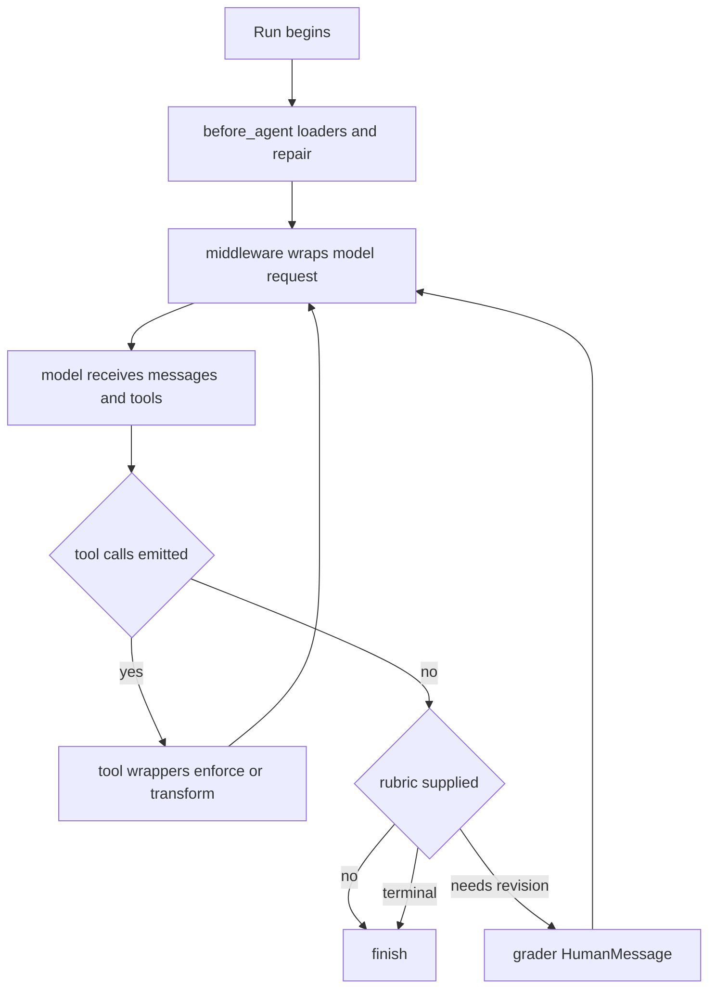

# Middleware Catalog

`deepagents.middleware` is the SDK public import surface for built-in capability middleware and its supporting types. Use middleware when a concern must shape every model request, inject tools or prompt context, or retain typed cross-turn state: an `AgentMiddleware` wrapper runs before an LLM request, unlike a plain callable in `tools=`, which runs only after the model selects it. Keep an isolated, consumer-specific operation as a plain tool instead.

This is a capability lookup and change-safety guide. See [Middleware stack](../architecture/middleware-stack.md) for ordering, [Context management](context-management.md) for compaction, [Permissions and HITL](permissions-hitl.md) for approval policy, and [Subagents and skills](subagents-skills.md) for delegation design.

## Catalog at a glance

| Need | Owner and entrypoint | State, tools, and boundary |
| --- | --- | --- |
| Workspace access and large-result recovery | `FilesystemMiddleware` | Adds filesystem tools; has backend-aware availability, permission enforcement, and result offload. |
| Automatic context compaction | `SummarizationMiddleware` / `create_summarization_middleware` | Persists summarization event/session state and history in the backend. |
| Model-initiated compaction | `SummarizationToolMiddleware` / `create_summarization_tool_middleware` | Adds `compact_conversation`; shares `_summarization_event` with automatic compaction. |
| Persistent project instructions | `MemoryMiddleware` | Loads `AGENTS.md` contents into private `memory_contents` and normally appends it to each request's system message. |
| Progressive-disclosure workflows | `SkillsMiddleware` | Loads private `skills_metadata` before the run and advertises metadata and readable paths rather than full skill instructions. |
| Blocking specialist delegation | `SubAgentMiddleware` | Adds `task`; raw or compiled children run inline and return a result to the caller. |
| Remote background delegation | `AsyncSubAgentMiddleware` | Adds start/monitor/update/cancel/list tooling and persists remote task records in `async_tasks`. |
| Quality gate at natural stop | `RubricMiddleware` | Uses private rubric bookkeeping and may jump back to the model with grader feedback. |
| Resume-history repair | `PatchToolCallsMiddleware` | Repairs incomplete tool call/result pairs in `before_agent`. |
| Filesystem approval wiring | `_fs_interrupt` during graph construction | Turns interrupt permission rules into `HumanInTheLoopMiddleware` predicates; it is not filesystem authorization. |
| Provider cache breakpoints | `append_prompt_caching_middleware` | Adds provider middleware before optional memory. |
| Harness-profile tool consistency | `_ToolExclusionMiddleware` | Removes excluded tools from requests and rejects excluded calls at dispatch; not a security boundary. |

Underscore-prefixed modules are internal assembly helpers, not the stable consumer import contract.

## SDK assembly and lifecycle

`create_deep_agent()` constructs the main SDK stack in this order: optional skills, filesystem, optional synchronous subagents, automatic summarization, and `PatchToolCallsMiddleware`; it then optionally adds async subagents. Harness extra middleware follows that core, then provider caching, optional memory, optional HITL, custom middleware placement, and finally tool exclusion. The assembler collects `PrivateStateAttr` fields from all participating schemas and gives those names to `SubAgentMiddleware`, so they can be stripped at the child boundary.

The diagram shows hook ownership, not a promise that every stack contains a rubric. The SDK default includes repair and automatic summarization; `RubricMiddleware` is installed by callers or by the product layer. A custom request wrapper should not assume it can restore excluded tools, because exclusion is appended last. A state schema whose annotations cannot be resolved at runtime is skipped with a warning by `private_state_field_names`; its nominally private values can consequently be forwarded to and merged back from subagents.

## Filesystem, artifacts, and approval

`FilesystemMiddleware` exposes `ls`, `read_file`, `write_file`, `edit_file`, `delete`, `glob`, `grep`, and, only for a sandbox-capable backend, `execute`. An explicit allowlist must contain `read_file`; merely listing unavailable `execute` or `delete` does not make them usable. Its default `StateBackend()` is ephemeral. Use a `BackendProtocol` implementation—commonly a routed `CompositeBackend`—when result artifacts or conversation history must outlive state; pass an initialized instance, not a backend factory.

Large tool outputs can be written to the configured artifact root under `large_tool_results` and replaced in the request with a line-numbered head-and-tail preview plus `read_file` recovery guidance; non-text blocks are retained. The shared eviction helper also supports summarization's overflow path. `read_file` needs special handling there: its already-backed content is head-sliced and points to the original path, whereas another oversized tool result is offloaded and stubbed. Video reads are optional: `_video` lazily uses the PyAV/Pillow dependencies, interprets `read_file` offset and limit as seconds, and emits sampled timestamped image blocks.

Filesystem policy has separate responsibilities:

* `FilesystemMiddleware` directly enforces deny rules in tool implementations.
* Graph assembly converts `interrupt` rules into `HumanInTheLoopMiddleware` `interrupt_on` entries. Exact tools are matched by normalized path; bulk tools interrupt when their search area overlaps an interrupt rule, and pathless bulk searches are conservatively interrupted. A prior deny wins for an exact match.
* Permissions combined with an execution-capable backend are rejected unless all paths are scoped to backend routes, because execute-level permission enforcement is not implemented. HITL approval does not supply that missing authorization.

## Context, memory, and caching

Automatic summarization counts the effective prompt, including tool schemas when supported, and compacts when its resolved model-aware threshold is reached. It offloads older history, keeps recent messages, and records a private event so later requests can reconstruct the effective summary-plus-tail history. On `ContextOverflowError`, it also attempts compaction and clips a trailing `ToolMessage` batch. A failed history write does not stop summarization, but leaves no recovery archive and emits a warning.

`SummarizationToolMiddleware` is the manual counterpart: it never compacts on its own, adds `compact_conversation`, and refuses calls made too early—roughly before half the automatic trigger. The factory creates its engine with model-aware defaults. Pair the tool layer with automatic summarization if both behaviors are wanted; `create_deep_agent()` already supplies the automatic layer.

`MemoryMiddleware` loads configured sources in order once per state lifetime, skips missing files, fails other download errors, strips HTML comments for display, and stores the contents privately. Its default system-prompt fragment is applied per request; `system_prompt=None` suppresses only injection, not loading. With `add_cache_control=True`, the final system block is marked ephemeral only for a runtime `ChatAnthropic` model.

`append_prompt_caching_middleware` always appends Anthropic prompt caching with unsupported models ignored and adds Bedrock or Fireworks caching only when their optional integrations import. It precedes memory in graph assembly, allowing memory to add the second Anthropic cache breakpoint without making the stable prompt prefix churn.

## Skills and delegation

`SkillsMiddleware` implements the agent-skills progressive-disclosure pattern. It reads source directories through backend APIs, discovers child `SKILL.md` files, parses metadata, and places names, descriptions, allowed tools, and paths in the system prompt. Sources can be paths or `(path, label)` pairs; later duplicate skill names override earlier ones. Discovery is skipped when checkpointed state already has `skills_metadata`; load failures are logged and represented as prompt diagnostics rather than being treated as instructions. `system_prompt=None` still loads state but does not advertise it.

`SubAgentMiddleware` requires at least one child and exposes its `task` tool. It compiles raw specifications using the supplied state schema, respects child `interrupt_on`, and blocks until the selected child completes. Keep sensitive or non-propagating values marked private: graph assembly supplies the complete private-key set after the stack is built. Compiled children own their schemas and configuration, so caller-side middleware cannot safely assume it controls them.

`AsyncSubAgentMiddleware` is distinct remote Agent Protocol machinery: definitions must be nonempty and uniquely named; its tools launch, monitor, update, cancel, and list background work. Starting a task returns promptly and records its identity in `async_tasks`, allowing it to survive compaction. This is not an asynchronous version of an arbitrary local child: it targets Agent Protocol-compatible servers, with URL-less local ASGI transport having async-invocation constraints.

## Rubric, repair, and product extensions

`RubricMiddleware` does nothing until invocation state supplies a `rubric`. At a natural stop it lazily constructs a separate structured-output grader, records an evaluation, and only loops on `needs_revision`, adding the feedback as a synthetic `HumanMessage` and jumping to the model. The grader can report `satisfied`, `needs_revision`, or `failed`; the middleware additionally reports `max_iterations_reached` and `grader_error`. A terminal non-satisfied evaluation does not replace the main agent's final response, so callers that need control flow must inspect rubric state, callback, or stream event. Grader callbacks are observational: their ordinary exceptions are logged and suppressed.

`PatchToolCallsMiddleware` runs before the agent and scans every `AIMessage`'s valid and invalid tool calls. If a call with a non-null id has no existing `ToolMessage`, it rewrites the full message list and inserts an error-status `ToolMessage` immediately after that AI message. Invalid calls get a malformed-or-truncated-arguments explanation; otherwise the explanation says that no result was recorded and the call may have been cancelled or interrupted. It makes resumed history structurally usable; it does not retry or execute the missing call.

Deep Agents Code composes additional product middleware around the SDK rather than changing its contracts. Its `CLICompactionMiddleware` subclasses `SummarizationToolMiddleware`, retains the model-initiated compact tool, replaces the SDK automatic summarizer by sharing its name, and adds hook-aware automatic and server-owned `/offload` paths. The product factory deliberately starts from `create_summarization_tool_middleware`, then applies its retry/runtime-model behavior. Product construction also adds retry and task-error middleware, builds a constrained rubric grader, and appends `ReliableRubricMiddleware` before passing the final list to `create_deep_agent()`; registered extension middleware is appended later with an `ExtensionRuntimeMiddleware` host.

## Safe customization and focused tests

Add middleware only for request shaping, state, or a cross-consumer concern. Keep sync and async hooks behaviorally aligned, preserve non-text message blocks when transforming content, and design an explicit backend-failure fallback before relying on offload. Do not conflate profile exclusion (model presentation/dispatch consistency), filesystem deny policy, and HITL approval. When changing graph assembly, test stack position as well as isolated middleware behavior—especially that caching precedes memory, custom middleware cannot re-advertise excluded tools, and private state is computed after all schemas are present.

Focused SDK coverage lives in `libs/deepagents/tests/unit_tests/test_middleware.py` and `test_graph.py`, including repair, tool exclusion, initialization, compaction, skills, memory, delegation, rubric iteration, and assembly wiring. Product compaction changes also need coverage of `CLICompactionMiddleware` and the `/offload` path, because hook/resume identity and server-owned compaction are product-specific behavior.
