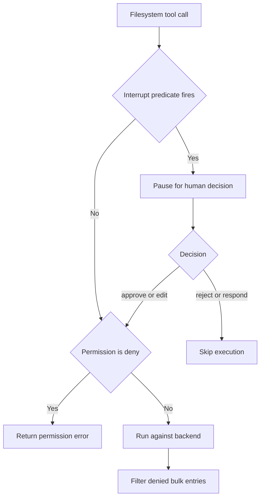
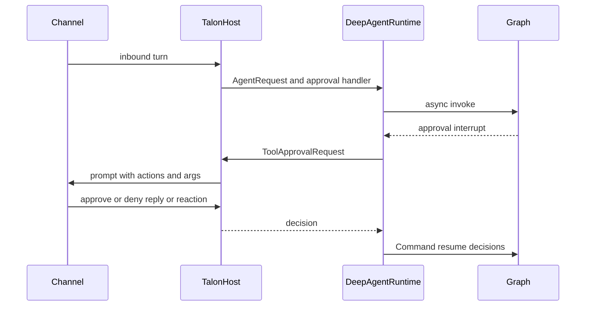
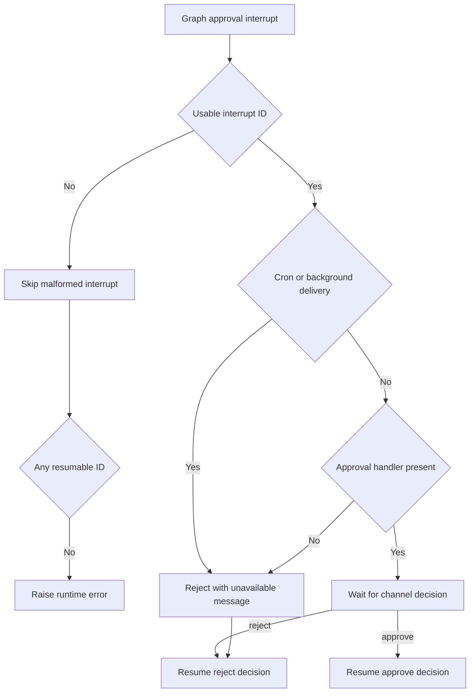

Permissions, approval prompts, and tool availability are separate controls. A model can propose a tool call that is later rejected at execution; an interrupt can pause an otherwise allowed call; and neither a prompt nor a channel approval is a sandbox. See [middleware stack](/openwiki/architecture/middleware-stack.md), [backends](/openwiki/concepts/backends.md), [filesystem tools](/openwiki/concepts/tools-filesystem.md), [Talon](/openwiki/integrations/talon.md), and [security](/openwiki/operations/security.md).

## Boundary model

Deep Agents follows a **trust-the-LLM** model: the agent can do anything its installed tools allow. Put containment in tool implementations, backends, and operating-system or deployment sandboxing—not in model instructions or the expectation that a model will self-police. HITL is opt-in and applies only to configured calls. `StateBackend` has no shell-execution tool; choosing `LocalShellBackend` is an explicit escalation of capability.

| Question | Control | Enforcement location |
| --- | --- | --- |
| Can the model propose a call? | Installed tool schemas | Agent construction |
| May a filesystem operation affect a path? | `FilesystemPermission` | Filesystem tool execution |
| Must a person decide before a configured call? | `HumanInTheLoopMiddleware` and `interrupt_on` | Graph routing before execution |
| Which Talon tools are gated? | Exact-name approval-policy snapshot | Talon graph construction |
| Who can answer a Talon prompt? | Channel host identity binding | `TalonHost` pending approval |

A denied call can remain visible in the transcript: the tool returns an error rather than performing the effect, and the model can react to that error. Likewise, bulk filesystem reads remove denied entries from results. This is enforcement of effects and results, not concealment of capabilities or attempted actions.

## Filesystem permissions

A `FilesystemPermission` has read and/or write `operations`, absolute glob `paths`, and a mode:

| Mode | Effect |
| --- | --- |
| `allow` | The matching operation proceeds; this is the no-match default. |
| `deny` | The tool returns a permission-denied error without the operation. |
| `interrupt` | Agent assembly configures a human approval interruption for matching calls. |

Patterns must start with `/`; paths containing `..` after slash normalization are rejected, and `~` is unsupported. Rules are ordered: rules for another operation are skipped, the first matching rule decides, and no match allows. Place a narrow exception before a broad rule.

Filesystem tools validate paths and check permission before reaching the backend. `FilesystemMiddleware` enforces denial and result filtering, but does not itself pause. The separate interrupt bridge means approval never overrides a denial: an approved or edited call re-enters the tool and receives the pre-execution check again.

### Bulk reads and recursive deletion

`ls`, `glob`, and `grep` can expose many paths. Their filters remove entries whose individual read permission is `deny`; `interrupt` entries remain because approval happened before the tool ran. A direct denied operation returns an error rather than being silently reduced to a partial operation.

Deletion is deliberately stricter. If the target might have descendants, any deny-write pattern that could match the target or its subtree blocks deletion, regardless of rule order. This prevents an earlier broad allow from defeating a later protected descendant. Backend listing distinguishes a confirmed leaf from a possible directory; unsupported or ambiguous listing is treated conservatively. A confirmed leaf returns to ordinary first-match resolution. Wildcard overlap still permits provably unrelated siblings, such as deleting `/work/notes.txt` under a deny for `/work/*.log`.

## Permission-derived HITL

`_build_interrupt_on_from_permissions` translates interrupt-mode filesystem rules into the `interrupt_on` map used by `HumanInTheLoopMiddleware`; it returns `{}` when no rule interrupts. Each affected filesystem tool gets `approve`, `edit`, `reject`, and `respond` plus a per-call predicate. `create_deep_agent` merges that map with caller-supplied `interrupt_on` for both the main agent and general-purpose subagent, installs one HITL middleware only if the merged map is nonempty, and separately supplies the raw rules to `FilesystemMiddleware`.

- **Exact-path tools**—`read_file`, `write_file`, and `edit_file`—interrupt only when first-match resolution yields `interrupt`. A prior `deny` avoids an unnecessary prompt.
- **Bulk tools**—`ls`, `glob`, `grep`, and `delete`—interrupt when their search subtree can overlap an interrupt-rule anchor. A missing path interrupts conservatively, and current-directory aliases normalized to `/.` are treated as `/`.
- `glob` also gates its `pattern`: an absolute pattern can choose a root independent of `path`; a relative pattern containing `..` cannot be safely localized and also fires the gate.

Caption: The graph pauses before a gated tool; the tool still enforces denial when it is invoked or resumed.

## dcode approval modes and shell policy

`ApprovalMode` is a per-session policy: `manual` pauses every gated call, `auto` enables classifier-backed review for an eligible graph, and `yolo` bypasses the approval gate. Invalid values become `manual`; the Shift+Tab cycle is Manual → Auto → YOLO → Manual subject to classifier eligibility and the YOLO-switcher setting. The mode is stored per thread under the `("deepagents_code", "approval_mode")` Store namespace with a SHA-256 thread-id key. Missing or malformed state is interpreted as Manual.

Dcode registers side-effecting and external-access tools with an approval predicate. It honors a trusted hook decision, never interrupts in YOLO, allows the Auto bypass only for an eligible graph, and otherwise interrupts. `AsyncApprovalHITLMiddleware` rereads the live mode after the model response and carries an in-process, non-checkpointed routing marker into standard HITL; synchronous operation warns and falls back to Manual.

Auto applies deterministic policy and classifier review rather than a blanket allowlist: allowed calls continue, policy-denied or classifier-unavailable calls become errors, and `require_human` calls escalate. In non-interactive shell-only operation, a restrictive allow-list can instead install `ShellAllowListMiddleware`, which rejects commands outside the list before execution; without such a list, standard HITL remains. `auto_approve=True` disables all HITL interruptions. Patch Tool Calls bypass `interrupt_on`, so `InterpreterConfig.ptc` is their control.

`AskUserMiddleware` is interaction, not approval of another tool: it pauses inside `ask_user` via LangGraph `interrupt()` and resumes as a `ToolMessage`. Mismatched answer counts and malformed payloads become errors; cancellation is represented as successful cancelled answers. Only a genuinely answered, bounded response with trusted thread, turn, and tool-call identity gets an `AskUserAuthorizationReceipt`, which Auto mode requires for authorization. Exception-catching tool middleware must re-raise `GraphBubbleUp` or it would swallow the graph interrupt.

## Talon approval policy and channel mediation

Talon is an experimental runtime. Its approval policy is not an environment overlay on an arbitrary `interrupt_on` map. `ToolApprovalStore` owns a bounded JSON mapping of **exact tool names** to booleans. `true` adds that name to the invocation snapshot's `interrupt_on` map with only `approve` and `reject`; `false` disables prompting for that name, rather than granting operator authority. The store materializes default gates for `update_tool_approvals`, `delete_conversations`, `update_mcp_server`, and `start_async_task` when its policy file is absent.

The runtime reads a snapshot at startup and again before each invocation. If policy changed, it constructs a replacement graph and makes that snapshot active. An in-flight invocation retains its graph and snapshot, so a policy edit applies on the next invocation—not retroactively to a waiting approval or running task. Policy updates are compare-and-swap by the file's SHA-256 byte revision; malformed, oversized, duplicate, wildcard, or non-boolean entries are rejected. The policy-editing tool also requires the runtime's trusted `APPROVAL_OPERATOR` context and an active snapshot.

The host derives that operator flag from configured channel exposure and identity, rather than accepting caller-provided message metadata. Scheduled and background-delivery routes clear it. This protects the policy control plane, but does **not** turn approved tools into isolated execution: Talon's default backend is `LocalShellBackend`, and actual containment must still be supplied by backend configuration and the deployment environment.

### Interrupt, decision, and resume

A graph invocation returns `__interrupt__` values. For each approval round, `DeepAgentRuntime` extracts usable interrupt IDs and action requests, asks the request's approval handler, and resumes the graph with a `Command` whose per-ID decisions approve or reject every action request. It allows at most 50 approval rounds. Missing IDs are skipped, but an interrupt batch with no resumable IDs raises instead of proceeding implicitly.

Caption: Talon transports a graph interruption to the originating channel and resumes only with a validated decision.

The failure and denial paths are explicit:

Caption: No channel handler, scheduled execution, and background delivery fail closed to rejection; malformed interrupt batches fail rather than auto-resuming.

For a normal channel turn, `TalonHost` stores one pending future by agent conversation, sends the tool names and argument preview, and accepts `approve`/`deny` or thumbs-up/thumbs-down. If the initiating sender identity is known, a text response must come from that sender; an unrecognized response re-prompts. Reactions must additionally match the provider, conversation, exact approval-prompt message ID, and sender when bound; mismatches are ignored. Reactions and runtime approval events log stable references and action names rather than argument values by default; `DEEPAGENTS_TALON_APPROVAL_LOG_RAW_IDS=true` opts in to raw reaction identifiers.

Cron-triggered calls, background-delivery calls, and ordinary calls with no approval handler are resumed as rejects with explanatory messages. A scheduled job can still deliver its eventual result to its origin chat, but it has no operator approval or authorization handlers; delivery into a chat must not inherit the original user's authority.

## Operations and focused tests

- Use literal-leading absolute protected anchors such as `/secrets/**`; a leading-wildcard interrupt pattern anchors at `/` for bulk overlap and can prompt for almost every bulk call.
- Test direct paths and bulk roots, including omitted paths, `.`, absolute glob patterns, relative `..` patterns, and directory versus confirmed-leaf deletion.
- Treat `interrupt_on` as selective approval routing, not a replacement for a sandbox or filesystem denial. Review interpreter PTC separately.
- In Talon, protect and validate the policy file, use stable channel sender and message identities for approvals, and expect scheduled/background/no-handler gated calls to reject. Policy changes need a new invocation.

Focused coverage includes `libs/deepagents/tests/unit_tests/test_permissions.py` for permission precedence, bulk bypass protection, and delete overlap; `libs/code/tests/unit_tests/test_approval_mode.py` for fail-closed approval state; `libs/talon/tests/test_runtime.py` for command resume, rejection, cron denial, and stable audit logs; `libs/talon/tests/test_host.py` for reply/reaction identity binding; and `libs/talon/tests/unit_tests/test_tool_approvals.py`, `test_tool_approval_runtime.py`, and `test_tool_approval_authorization.py` for snapshot, policy-update, and trusted-operator boundaries.
