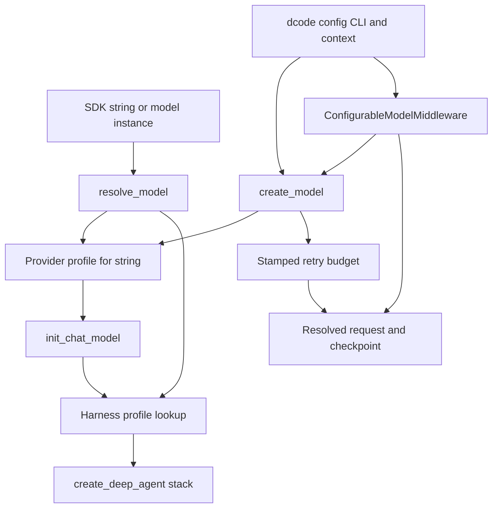

# Models, Profiles, and Retries

Model behavior is deliberately owned by separate layers:

1. **SDK provider profiles** add construction behavior for a model *string*.
2. **SDK harness profiles** shape the agent assembled around an already-resolved model.
3. **Deep Agents Code (dcode)** applies operator configuration, creates concrete models, supports per-call replacement, records resume/cache state, and owns model-node retries.
4. **Talon** is a separate host runtime: it uses provider profiles when it must construct a model, but has its own environment-based endpoint and context-size adjustments and retries whole graph invocations.

A provider profile is not a session model selector; a harness profile is not a provider-client constructor. dcode's TOML/CLI configuration and Talon's environment are product policy, not entries in the SDK's process-global profile registries.

## Resolution and assembly



Caption: provider profiles affect construction, harness profiles affect SDK agent assembly, and dcode overlays product configuration and request lifecycle behavior.

## SDK construction: provider profiles

`resolve_model` accepts `str | BaseChatModel`. A supplied `BaseChatModel` is returned unchanged; only a string is constructed with `init_chat_model(..., **apply_provider_profile(spec))`. Consequently, provider-profile defaults, hooks, and factories do not retrofit a caller-created model. `model_matches_spec` is used by dcode to avoid unnecessary replacements: it compares provider and identifier with aliases/case normalization, but preserves compatibility by accepting an identifier match when a custom model cannot reveal its provider.

A `ProviderProfile` has three construction-time extension points:

- immutable static `init_kwargs`;
- `pre_init(spec)`, for checks or side effects before construction; and
- `init_kwargs_factory()`, for values derived at resolution time.

`apply_provider_profile` is the construction boundary. It validates/looks up the profile, runs `pre_init` unless `run_pre_init=False`, then produces a fresh dictionary with this precedence:

```text
profile init_kwargs < factory output < caller kwargs
```

Exceptions from a hook or factory abort that construction; the SDK does not continue with a partly applied profile. dcode catches such failures and reports `ModelConfigError` with package/update and explicit `--model-params` guidance.

### Keys, layering, and bootstrap

Provider and harness profiles use either a provider key or a single `provider:model` key. Lookup rejects empty, double-colon, and empty-half specs before registry access. For a qualified spec, a provider-wide registration is combined with an exact-model registration, with the latter higher priority. Provider re-registration is additive: static maps merge, `pre_init` functions run base then override, and both factories run for each resolution with later values winning.

Registries bootstrap lazily on their first lookup or registration. Built-ins are registered first; third-party zero-argument entry points from `deepagents.provider_profiles` and `deepagents.harness_profiles` then layer on them. Bootstrap serializes competing threads and permits same-thread re-entry from plugin registration. A broken built-in restores registry snapshots and raises; third-party enumeration, import, non-callable, and invocation failures are warned/logged and isolated. Plugin enumeration order is not an override contract.

## Harness profiles: post-construction runtime shaping

`create_deep_agent` resolves its model first and then selects the harness profile. A string uses the original spec; for a pre-built model, lookup derives a canonical `provider:identifier` from model metadata. A bare inferred identifier is deliberately not used as a registry key, preventing a proxy model named `openai` from accidentally matching a provider-wide entry.

A `HarnessProfile` can set a base prompt or suffix, replace tool descriptions, exclude tools or middleware, provide extra middleware, and tune the auto-added general-purpose subagent. Prompt assembly is `USER → BASE → SUFFIX`; with a `SystemMessage`, profile text is appended as a text block so existing content blocks, including cache-control markers, are retained. `HarnessProfileConfig` is the YAML/JSON-friendly subset: it supports plain middleware names but intentionally rejects runtime `extra_middleware` and arbitrary class-path serialization.

Profiles are additive but field-aware: scalar prompt values inherit when unset, descriptions merge by tool name, exclusion sets union, middleware merges by concrete type, and general-purpose subagent settings merge field by field. `extra_middleware` is materialized independently for stacks that dcode/SDK constructs, allowing a factory to create fresh instances.

### Stack boundaries and safety implications

`excluded_middleware` filters assembled stacks by exact middleware type or `.name`; unknown entries and removal of `FilesystemMiddleware` or `SubAgentMiddleware` fail fast because they support filesystem tools, permissions, and `task` dispatch. To remove the default `task` exposure, disable the general-purpose subagent and supply no synchronous subagents. 

`excluded_tools` is enforced by `_ToolExclusionMiddleware` after custom and tool-injecting middleware, so it applies to caller-provided and injected tools in the main, general-purpose, and declarative synchronous subagent stacks. It controls what the model sees, not authorization: backend and permission enforcement remain separate responsibilities.

## dcode construction and precedence

`create_model` is the product construction entry point. It accepts a qualified spec, detects a provider for a bare name, or resolves a default. It canonicalizes provider/model identity before enforcing `models.allowed`; the allowlist gate precedes stored-credential bridging, profile hooks, and provider imports, so a rejected model cannot trigger those side effects.

For an admitted model, dcode resolves provider/model TOML kwargs (including credentials and endpoint wiring), layers the SDK provider profile beneath them, and applies `--model-params` last:

```text
SDK provider-profile defaults < config.toml provider and per-model params plus credential wiring < --model-params
```

Within `params`, flat provider values are defaults and the model-named table shallow-merges over them. dcode can instantiate a configured `class_path` directly; the OAuth-backed `openai_codex` route also bypasses generic `init_chat_model` to install its token provider. In contrast, TOML and CLI `profile_overrides` modify the resulting model's capability `profile` metadata, not an SDK `HarnessProfile`.

The returned `ModelResult` carries the concrete model, resolved identity, capability-derived context and modality metadata, and retry metadata. It does not mutate global runtime state by itself; callers decide when to commit metadata. dcode stamps the resolved retry budget on the concrete model so a request-time switch carries the right provider budget. A slotted custom model may reject that private attribute; construction remains usable and retry middleware falls back to its startup budget with a warning.

## Request-time model configuration, prompt cache, and persistence

`create_cli_agent` installs `ConfigurableModelMiddleware` as the main stack's outer model wrapper. It also gives inheriting subagents a non-persisting instance, while strict non-persisting instances protect nested grader routing. The retry middleware is inside automatic compaction: retrying repeats the final model handler rather than compaction or archive side effects.

For each model call, `ConfigurableModelMiddleware` parses `runtime.context` as `CLIContextSchema`:

- `model` creates a replacement only if it does not match the current model; it forwards the retained explicit CLI retry value and per-call capability-profile overrides to `create_model`.
- ordinary `ModelConfigError` falls back to the current model unless strict resolution is selected; an allowlist `ModelNotAllowedError` always propagates rather than silently using the old model.
- `model_params` shallow-merge into that request's `model_settings`; shared model configuration is not mutated.
- on a successful swap, the model-identity section in the system prompt is updated from the returned `ModelResult`; when moving away from Anthropic, `cache_control` is removed from settings that a non-Anthropic provider cannot accept.

A thread ID enables provider-specific cache routing without overwriting caller settings: Fireworks receives `prompt_cache_key` and `x-session-affinity` when absent; OpenAI-provider models receive `prompt_cache_key` unless `models.openai_prompt_cache_key` disables it. The OpenAI behavior intentionally applies to OpenAI-compatible endpoints as identified by the model provider.

Only a successful parent call emits an `ExtendedModelResponse` carrying a private checkpoint `Command`. `_model_spec` and `_model_params` represent the actual resolved spec and *runtime-only* overrides used for resume. Cache freshness gets separate fields for request start time, model spec, endpoint identity, and the cache-relevant projection of effective parameters. This separation prevents configuration defaults such as temperature, headers, or retries from becoming sticky session overrides while still preventing a false cache-identity change on the next turn. Async model creation and cache/config reads are offloaded from the guarded event loop.

## Retry ownership and lifecycle

`CodeModelRetryMiddleware` owns dcode's model-node retry policy, rather than retrying the entire turn. `create_model` resolves its retry budget in this order: `--max-retries`, `[retries.<provider>].max_retries`, `[retries].max_retries`, then five; zero disables retry. After all normal kwargs merge, dcode disables a known provider SDK retry parameter so provider retries cannot multiply node attempts. For a custom provider, `[retries.<provider>].param` can name the SDK retry kwarg; when dcode cannot identify one, it warns that nested retries may remain active.

The middleware reads a stamped budget from `request.model`, falling back to its construction budget. It retries only the model handler, preserving completed tool calls. A direct `ModelError.is_retryable` result is authoritative; otherwise classification recognizes selected HTTP statuses (408, 409, 429, and 5xx), known provider SDK errors, and narrowly selected transport faults, including errors nested in exception groups or cause/context chains. `GraphBubbleUp` is re-raised as graph control flow.

A valid `Retry-After` is used up to 60 seconds; otherwise delays are jittered exponential backoff starting at 0.2 seconds, factor two, capped at 10 seconds. The interactive model node also limits total retry sleep to 60 seconds. Each attempt emits correlated start/complete events and each scheduled retry emits a status event. If output may already have streamed, the event tells clients to mark that attempt incomplete before replay; retry exhaustion re-raises the provider error rather than fabricating an AI answer. Auxiliary model calls reuse the selected model's stamped budget and may supply a cumulative delay cap to expose the original provider error before an enclosing deadline cancels them.

## Talon: a separate runtime policy

Talon builds its graph at `DeepAgentRuntime.start`. Its `_resolve_model_from_env` normally leaves the configured model string for SDK assembly. It explicitly constructs a model with `apply_provider_profile` and `init_chat_model` only when an OpenAI `OPENAI_BASE_URL` override or `DEEPAGENTS_TALON_CONTEXT_SIZE` needs a concrete instance; context size is written into that model's capability profile. Talon then passes the resolved model and local subagent models to `create_deep_agent`.

Talon does **not** use dcode's model-node retry middleware. Its `max_retries` is validated as at least one and retries the complete graph `ainvoke` for its own broader retry predicate, with integer exponential backoff capped at ten seconds. This is a distinct ownership boundary: changing dcode retry classification or per-provider TOML budgets does not change Talon invocation retries.

## Change and test guidance

- Put reusable provider constructor defaults, dynamic kwargs, and pre-construction checks in `ProviderProfile`; put reusable prompt/tool/stack behavior in `HarnessProfile`. Both APIs are beta and registration is additive.
- Put operator policy in dcode `config.toml`, CLI options, and allowlists; use runtime context only for invocation/session selection and request settings. Treat `class_path` as trusted configuration because it imports executable Python.
- When changing switching, test both sync and async paths: fallback versus strict failure, policy denial propagation, prompt identity replacement, cache-setting injection, and the distinction between resume overrides and cache identity.
- When changing retries, test model-stamped budgets, SDK-loop disabling, nested error classification, `Retry-After`, graph interrupts, streaming supersession events, exhaustion, and cumulative delay caps. Focused suites include `libs/code/tests/unit_tests/test_configurable_model.py`, `test_model_retry.py`, `test_config.py`, and `libs/deepagents/tests/unit_tests/test_harness_profiles.py`.

## Related pages

- [Code agent architecture](/openwiki/architecture/code-agent.md)
- [SDK construction & execution](/openwiki/architecture/sdk-construction-execution.md)
- [Configuration layering](/openwiki/concepts/config-layering.md)
- [Talon integration](/openwiki/integrations/talon.md)
- [Build a Deep Agent](/openwiki/workflows/build-a-deep-agent.md)
