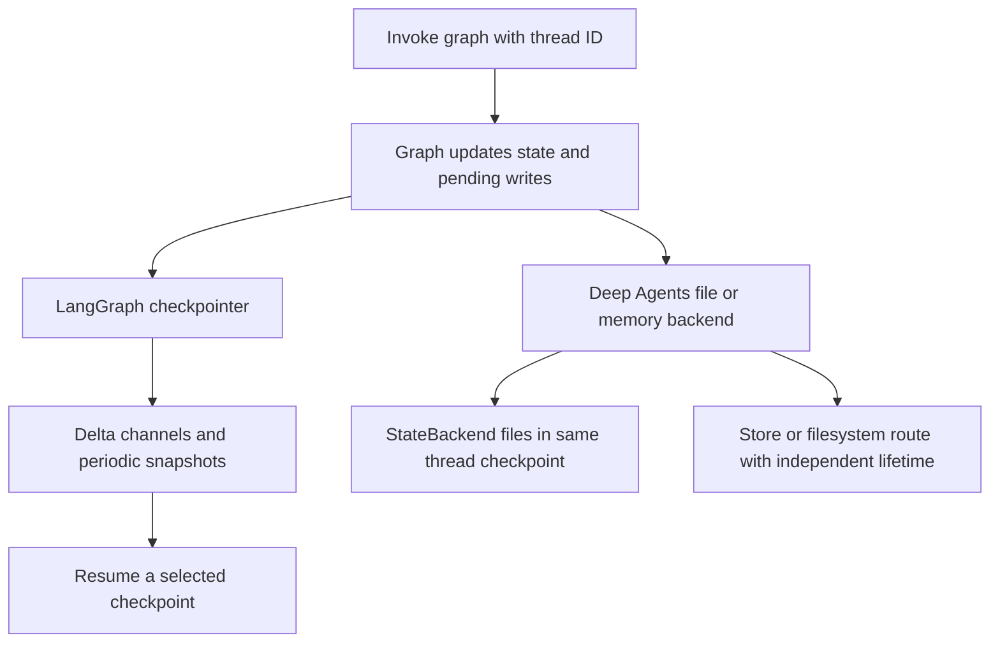
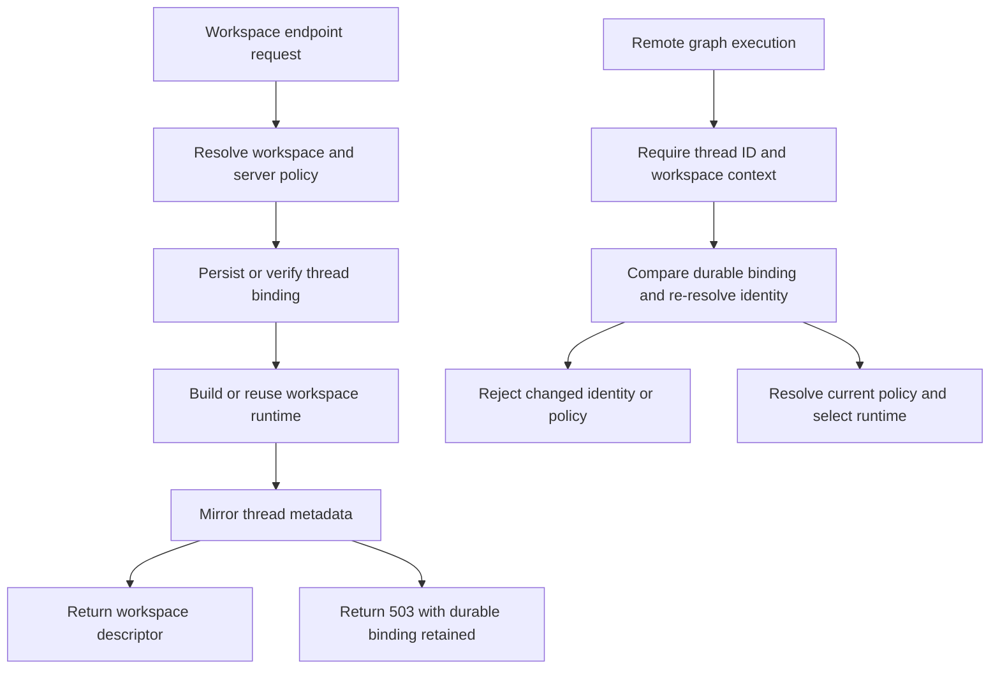
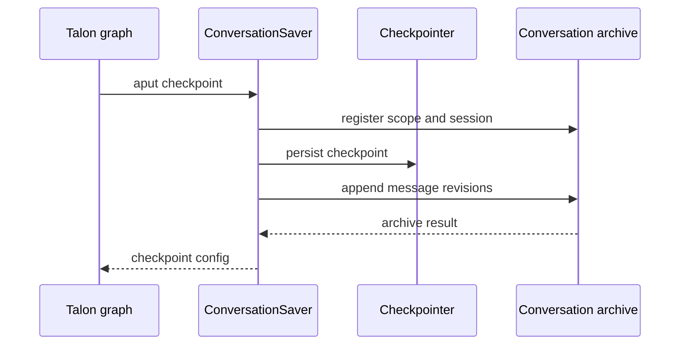

# State, Sessions, and Workspace Persistence

Persistence is not one database or one lifecycle. The system has independent owners with deliberately different scopes:

| Owner | Durable unit | What it is for | What it does not imply |
| --- | --- | --- | --- |
| LangGraph checkpointer | checkpoint history for a `thread_id` | graph state, message history, interrupts, pending writes, and resume points | a global filesystem, a workspace authorization, or searchable long-term history |
| Deep Agents backend or store | backend-defined files and memories | filesystem and memory lifetime appropriate to its route | checkpoint durability unless the backend is state-routed |
| dcode local SQLite | LangGraph checkpoint and write rows | local CLI resume and thread catalog | a second transcript database |
| dcode workspace binding | one thread-to-workspace policy record | remote workspace identity and runtime authorization | the conversation checkpoint itself |
| ACP server | protocol session mapped to a graph thread | client session metadata and replay when enabled | restart recovery with the default in-memory saver |
| Talon archive | scoped, append-only transcript records | cross-session conversation discovery and retrieval | an atomic extension of checkpoint storage |

A durable checkpoint alone therefore does not make files global, and a thread ID alone does not authorize remote execution in an arbitrary directory. See [Context management](/openwiki/concepts/context-management.md), [Runtime behavior](/openwiki/architecture/runtime-behavior.md), [ACP](/openwiki/integrations/acp.md), and [Talon](/openwiki/integrations/talon.md).

## Checkpoints are the graph-resume authority

Persistence in Deep Agents has two separate axes: LangGraph checkpoints preserve conversation state, message history, interrupts, and resumability per thread, while Deep Agents backends handle filesystem and memory persistence whose durability depends on the backend route.

`create_deep_agent` forwards its optional `checkpointer` and `store` to LangChain's `create_agent`. A checkpointer persists graph state between runs; a backend using a store route separately requires `store`. Select them independently: use a restart-durable saver before promising restart-safe resume, and select a backend whose route has the required sharing and retention semantics.

The default `StateBackend` is intentionally thread-scoped. It reads and queues `files` updates through LangGraph's `CONFIG_KEY_READ` and `CONFIG_KEY_SEND`, so files are checkpointed with graph state and survive within that conversation thread, not across threads. It can only run inside graph execution. Choose a store- or filesystem-backed backend when data must outlive or cross threads.

### Delta checkpoints and state schemas

`DeepAgentState` is the default `state_schema` and replaces only `messages` from LangChain's `AgentState` with `DeltaChannel(_messages_delta_reducer, snapshot_frequency=50)`. The channel persists message deltas and writes a full snapshot every 50 pregel steps. This changes long-thread persisted message volume from quadratic to linear while bounding reconstruction depth. `FilesystemState.files` uses the same delta/snapshot pattern.

A custom `state_schema` should extend the `DeepAgentState` TypedDict to retain that message-channel contract. This is a type-checker requirement; it is not runtime-validated with `issubclass`. Consumers that inspect messages must tolerate a checkpoint whose latest payload has no inline complete message list.

This flow separates graph recovery from backend data lifetime: only the state-backed file route shares the thread checkpoint.

## dcode local sessions

The local CLI obtains an `AsyncSqliteSaver` from `sessions.get_checkpointer()`, calls `setup()`, and passes it to CLI agent graphs. The hardened global database path is `DEFAULT_STATE_DIR / "sessions.db"`. LangGraph checkpoint and write rows are consequently both the resume source and dcode's local thread catalog; dcode does not maintain a duplicate conversation table.

`list_threads` derives agent name, created and updated timestamps, Git branch, working directory, and latest checkpoint ID from checkpoint metadata. It can enrich rows with checkpoint-derived prompt and visible-message-count data and filters by agent, branch, and exact `cwd`. A covering index is created opportunistically so the catalog query avoids reading large checkpoint blobs; failure only logs and falls back to a slower correct table scan.

When a delta checkpoint does not inline `messages`, dcode reconstructs a visible message count by replaying root-namespace `messages` writes in checkpoint, task, and write-index order. It deliberately excludes subgraph writes under the same thread ID. This is an estimate for dcode's usual append-only head-of-thread history, not a general branch-aware transcript engine.

`ResumeStateMiddleware` adds private checkpoint channels for facts required to rehydrate a dcode session. Graph middleware writes model-turn facts after successful calls; accepted goal and rubric choices may be client-written through `aupdate_state`; pending proposals and agent status changes are graph-written. As checkpointed values, these restore with the selected checkpoint rather than as a thread-wide aggregate.

On command startup, after argument parsing, dcode makes a best-effort, idempotent migration from `~/.deepagents/` to `~/.deepagents/.state/`. It preserves destination collisions and moves `sessions.db` together with its WAL and shared-memory sidecars. Back up, move, or manually resolve those three files as a unit.

## Remote dcode: a durable workspace authority

A remote dcode workspace binding is distinct from graph state. It records a canonical resolved workspace identity, schema version, generation, resource key, configuration fingerprint, and server-resolved resource policy for one thread. Initial `cwd` input is untrusted: it must be a nonempty absolute existing directory without traversal and is canonically resolved. The public execution payload omits the policy JSON; server code retains that authority.

This restart and recovery flow shows why a client must distinguish a failed metadata mirror from a failed bind: after that 503, retrying with the same binding is safe, while a different workspace or protected policy is a conflict.

`bind_thread_workspace` uses `BEGIN IMMEDIATE` and `INSERT OR IGNORE`, then compares the existing and proposed records. Equivalent claims are idempotent. A different workspace identity or protected policy raises `WorkspaceConflictError`, preventing concurrent first claims from mixing workspaces. Compatible legacy bindings are upgraded to schema version 3 only after workspace identity and recorded session-policy checks; current bindings reject configuration drift.

The endpoint resolves workspace policy on the server and rejects client claims to project workspace policy. It binds before mirroring LangGraph thread metadata, and maps a later metadata-mirror failure to 503 while leaving the binding durable. Before execution, `make_graph` requires a nonempty thread ID and workspace context. `require_thread_workspace` compares every public context field with the durable record, rejects unsupported schema or claimed-policy mismatch, and re-resolves the workspace identity. Runtime selection then rejects current project-policy or server-configuration fingerprint drift instead of silently changing a thread's authority.

## ACP session recovery

`AgentServerACP` maps an ACP `session_id` to LangGraph `thread_id` of the same value. The graph configuration persists an ACP marker, `cwd`, and selected mode or model in checkpoint metadata. `new_session` writes that metadata only when `load_sessions=True`; changes to mode or model then persist it and rebuild a factory-created graph as needed.

`load_sessions` is an opt-in capability, not a durability guarantee by itself. It is advertised only with `load_sessions=True`, requires a compiled graph with a checkpointer, verifies that the checkpoint is marked as an ACP session and that its saved `cwd` exactly matches the load request, restores supported mode/model choices, and replays saved messages and tool calls to the client. An ACP server that has no checkpointer gets a `MemorySaver` on first prompt; that supports in-process conversation state but cannot survive a server restart. Configure a restart-durable saver before enabling recovery across restarts.

## Talon: checkpoints plus a separately owned archive

Talon's experimental `ConversationSaver` wraps an async LangGraph saver and a `StoreConversationArchive`, but takes ownership of neither. It delegates checkpoint reads, listing, delta reconstruction, and pending writes to the underlying saver. For root graph checkpoints carrying trusted Talon channel/chat metadata, it registers the session in the archive, gathers committed message revisions, persists the checkpoint, then appends those revisions to the archive under one wrapper lock. Subgraph namespaces are not archived.

The two writes do **not** share a transaction. An archive failure propagates after the checkpoint has been persisted; retrying the same checkpoint write repairs the archive without duplicate revisions because archive writes are idempotent. Cancellation waits for both writes to finish before it propagates, so history reset cannot race an unfinished archive operation. Deletion is similarly ordered: delete the checkpoint thread first, then remove its archive registration; a failure leaves registrations available for retry. Stop chat workers before clearing a scope.

This sequence has checkpoint-before-archive ordering, not cross-store atomicity.

`StoreConversationArchive` stores scoped transcript chunks, summaries, and recovery records in a metadata `BaseStore`; its optional vector store must be a separate instance. A session registration binds each transcript to the trusted channel/chat scope, and visibility checks that live ownership before returning an entry. Chunk deduplication keys include session, message identity, revision, and part, allowing retry repair without duplicated revisions. It excludes Talon's own history-tool output from archived tool messages to avoid recursively archiving retrieval results.

`open_history` selects history storage from `DEEPAGENTS_TALON_HISTORY_URI`, defaulting to the same SQLite URI as `checkpoint_path`; that default means two independent logical users may share a database file, not that archive writes become checkpoint transactions. Built-in URI schemes are SQLite/file, PostgreSQL, and MongoDB; an installed `deepagents_talon.history_backends` entry point can supply another scheme. The archive namespace includes the stable assistant ID, and startup validates configuration, initializes recovery/indexing, and converts backend failures to sanitized `TalonConfigError` messages. Optional vector search and indexing are configured separately from checkpoint persistence.

## Operational invariants

- Promise restart-safe graph resume only after configuring a durable LangGraph checkpointer. Treat `MemorySaver` as process-local state.
- Treat checkpoints, archives, memories, and workspace bindings as separate retention and backup domains. Do not infer authorization from checkpoint metadata or searchability from a checkpoint.
- Use `StateBackend` only for thread-local checkpointed files. Preserve the delta channel when extending state schemas.
- Preserve dcode SQLite's database, `-wal`, and `-shm` sidecars together. Investigate migration collisions rather than deleting either copy.
- Bind a remote thread before execution and send its exact workspace payload. Start a new thread for a different workspace or resolve policy drift explicitly.
- For Talon, plan for retry after an archive error: the checkpoint may already be durable. Provide one active archive writer per namespace and stop workers before destructive history operations.
