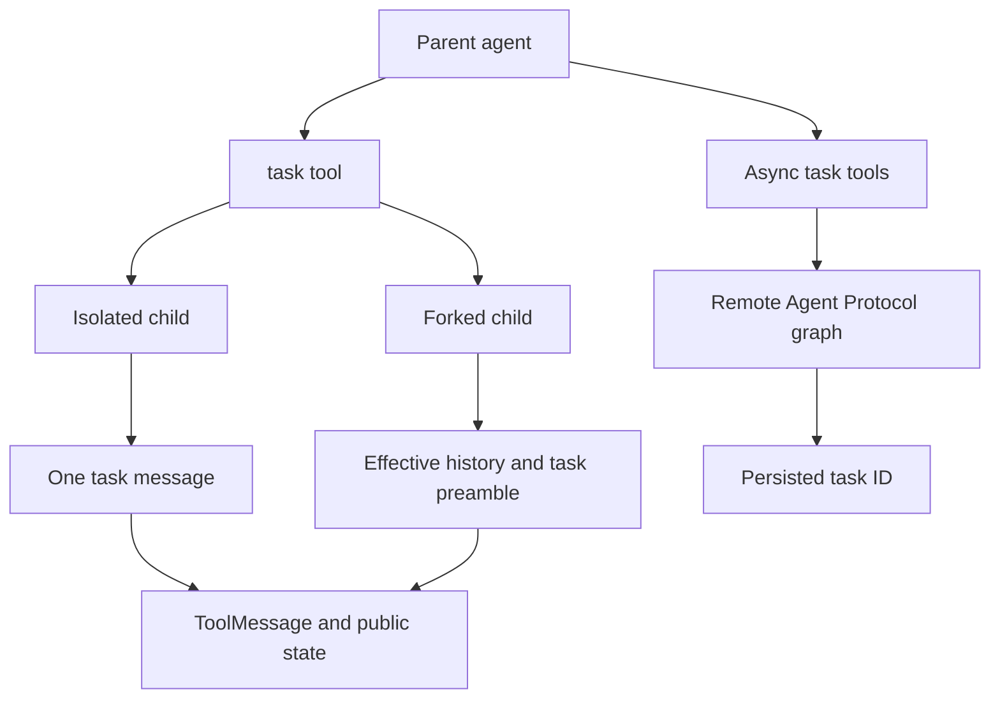
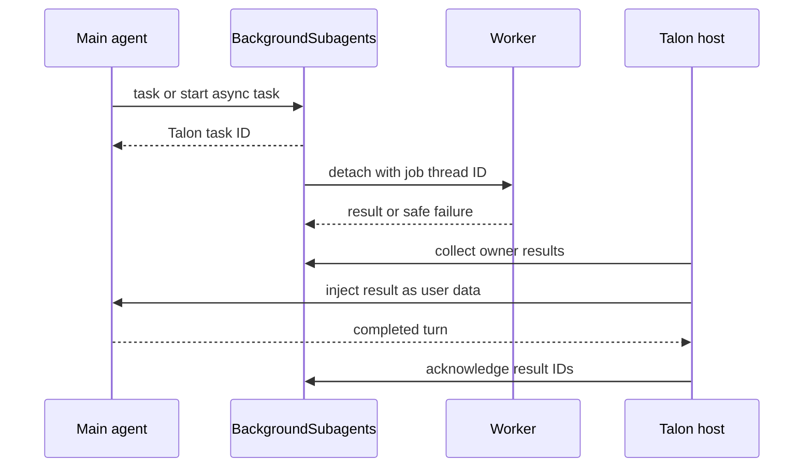

# Subagents and Skills

Deepagents offers two complementary extension mechanisms. **Subagents** delegate bounded work to another agent or graph. **Skills** expose a discoverable instruction library without adding every full instruction to every model request. `create_deep_agent` composes the middleware; `SubAgentMiddleware`, `AsyncSubAgentMiddleware`, and `SkillsMiddleware` own the SDK behavior. See [middleware stack](/openwiki/architecture/middleware-stack.md), [context management](/openwiki/concepts/context-management.md), and [permissions and HITL](/openwiki/concepts/permissions-hitl.md).

## Delegation choices

`create_deep_agent` routes a `subagents` specification by shape: `graph_id` becomes an `AsyncSubAgent` served by remote-task tools, `runnable` is a caller-owned `CompiledSubAgent` served by `task`, and every other entry is a declarative `SubAgent` compiled for `task`.

`isolated` is the default mode; `handoff` is only a legacy alias for it. `fork` is experimental and is the sole context-inheriting mode. Invalid modes, duplicate inline names, and a separate `skills` declaration on a declarative fork fail validation.

*SDK delegation either waits for an inline report or persists a handle for remote work.*

## Inline `task`: isolation, results, and compilation

`SubAgentMiddleware` registers one `task(description, subagent_type)` tool. The name selects a child; an unknown name returns an error result. A valid invocation needs a tool-call ID so the middleware can return its parent-side `Command` with a `ToolMessage`.

An isolated child receives exactly one `HumanMessage` containing the description. The middleware excludes parent messages, todos, structured response, the fork marker, and private middleware state. This is **prompt and state isolation**, not configuration isolation: LangGraph's ambient per-key merge carries callbacks, tags, metadata, and configurable values, while the middleware adds the `ls_agent_type="subagent"` tracing marker.

The child must return a state containing `messages`, or delegation raises `ValueError`. A non-null `structured_response` is JSON-serialized; otherwise the middleware returns the last non-empty `AIMessage` text. Its `Command` transfers compatible non-private public state plus a `ToolMessage`, but excludes messages, todos, structured output, fork state, and private channels.

A `CompiledSubAgent` is opaque caller-owned code and must be compiled with a compatible `messages` state key. Raw declarative specs are compiled by `create_sub_agent`; they need resolved model and tools, may add `HumanInTheLoopMiddleware` through `interrupt_on`, and accept a declared response format. A per-call `configurable["__deepagents_subagent_response_format"]` override recompiles a raw spec; it is rejected for compiled entries.

## Declarative defaults, permissions, and fork inheritance

Declarative children inherit the parent model, tools, and filesystem permissions unless overridden. Supplied permissions replace the parent's rules, first matching filesystem rule wins, and permission-derived interrupts merge with explicit `interrupt_on`. Their base stack is filesystem, summarization, and patching; declared skills follow it, then harness-profile, prompt-cache, exclusion, and custom middleware processing. Unless disabled by the harness profile or explicitly replaced, the builder also supplies `general-purpose` with the parent model, tools, permissions, and default stack.

A fork reconstructs the parent's **effective** history: it drops a trailing unresolved tool-call AI message, applies the parent summarization event, and appends a task preamble. Declarative forks rebuild the inherited prompt and receive parent state except structured output and summarization bookkeeping; they mirror parent skills and memory prompt machinery where configured, but cannot define their own skills. Compiled forks receive effective messages but not private or ordinary excluded state. Both retain a guarded `task` tool; the private fork marker refuses nested delegation.

## SDK remote asynchronous subagents

`AsyncSubAgentMiddleware` provides `start_async_task`, `check_async_task`, `update_async_task`, `cancel_async_task`, and `list_async_tasks`. Starting creates a LangGraph SDK thread and run for the configured `graph_id`, then immediately records and returns the thread ID as the task ID. `async_tasks` merges records by task ID, retaining remote thread/run identifiers and timestamps across state updates and compaction.

Checking queries the tracked run and retrieves final thread output on success. Updating starts a replacement run on the same remote thread with `multitask_strategy="interrupt"`; task ID remains stable while run ID changes. Cancellation invokes the remote cancellation endpoint and records `cancelled`. Listing first filters on cached status, does not query terminal tasks, and preserves cached status on live lookup failure.

Clients are lazy and cached by URL plus resolved headers. The default resolved header is `x-auth-scheme: langsmith`; custom headers support self-hosted services. A URL-less spec uses in-process ASGI transport and requires an asynchronous parent invocation such as `ainvoke`; synchronous use raises `ValueError`.

## Skills: metadata first, instructions on demand

`SkillsMiddleware` progressively discloses skills. Before a session it lists immediate backend subdirectories, downloads candidate `SKILL.md` files, and injects an index of source locations, names, descriptions, annotations, allowed tools, and exact instruction paths. The model is directed to read full instructions only for an applicable skill.

Loading is defensive. A valid entry needs YAML frontmatter with non-empty `name` and `description`; malformed YAML, inaccessible or missing content, non-UTF-8 data, and oversized files are skipped with warnings. Name-format and directory-name violations warn for compatibility but do not prevent loading. Sources are loaded in order, with later same-named skills taking precedence.

`skills_metadata` and recoverable `skills_load_errors` are private state. Metadata loads once per session or checkpoint: a present `skills_metadata`, even empty, prevents reload. A custom prompt template requires `{skills_locations}`, `{skills_load_warnings}`, and `{skills_list}`; `system_prompt=None` suppresses prompt injection but not discovery or error logging.

## Talon: fresh local agents and detached background work

Talon is an experimental runtime with an intentionally different boundary. It reads remote definitions from `[async_subagents.<name>]` tables in `~/.deepagents/config.toml`, requiring non-empty string `description` and `graph_id`, with optional non-empty `url` and string-to-string `headers`. The CLI passes this fail-closed loader to `DeepAgentRuntime`: a missing file means no remote agents, but unreadable, malformed, or any invalid definition raises and prevents partial startup.

Local `AGENTS.md` roles are resolved from the assistant `agents/{name}/` directory or its parent fallback. They require name and description and may choose a model, exact unique tool attachments, and web tools. Talon compiles a local role as a fresh task-only agent with only applicable operator approval rules and no checkpointer. It rejects fork mode. Per task, `task(tools=[...])` may add available catalog tools to a named local role but cannot replace configured tools; duplicate or unavailable names fail.

`BackgroundSubagents` intercepts Talon's inline `task` and `start_async_task` calls and returns a Talon-generated ID immediately. Jobs are in-memory, bounded globally to 128 total and 4 running, scoped to the owning conversation, and run on a distinct worker thread ID. The main agent sees `list_subagents` and `cancel_subagent`, not the SDK polling/update tools. A background worker inherits host history and cron context but clears its authorization handler and disables operator approval; protected work therefore reports that approval is needed rather than waiting for a stale originating turn.

*Talon injects a completed worker result into a later owner turn and acknowledges it only after that turn completes.*

Completed non-cancelled results are pending until injected into the owning main-agent turn. The runtime returns acknowledged IDs to the host because only the host knows whether its reply reached the user: a discarded reply requeues just those IDs. A failed result-processing turn increments an attempt count; after three failed deliveries the result is marked dropped. Worker exceptions are logged while the model receives a generic failure result without arguments; timeout has a separate result. Remote workers stream their snapshotted original target with `on_disconnect="cancel"`, so reload does not retarget active work. None of this worker state survives a runtime restart.

`reload_subagent_configuration` explicitly resolves and builds a replacement graph under the tools lock, then activates it for later turns. On error it retains the existing graph. Active turns use their captured graph and background workers retain their original capability snapshot; inspect and cancel existing work before treating a removal as complete.

## Focused tests and safe changes

SDK tests cover subagent routing, modes and forks, state filtering, output extraction, dynamic formats, async task lifecycle, cache behavior, and ASGI restrictions. Skills tests cover malformed candidates, precedence, private one-time state, and template validation.

Talon's focused tests establish fail-closed TOML parsing; fresh-agent attachment and approval boundaries; conversation ownership, capacity, cancellation, separate worker threads, remote target snapshots, failure redaction, timeout behavior, and result delivery/requeue/drop semantics. In particular, `test_chat_continues_then_main_processes_background_result` verifies that a conversation can continue while the child runs and that a completed result is injected into a later main-agent turn. Preserve these tests when changing delegation: state inheritance, capability attachment, approval behavior, and result acknowledgement are security and lifecycle contracts.

## Related

- [Middleware stack](/openwiki/architecture/middleware-stack.md)
- [Context management](/openwiki/concepts/context-management.md)
- [Permissions and HITL](/openwiki/concepts/permissions-hitl.md)
- [Talon](/openwiki/integrations/talon.md)
- [Build a deep agent](/openwiki/workflows/build-a-deep-agent.md)
