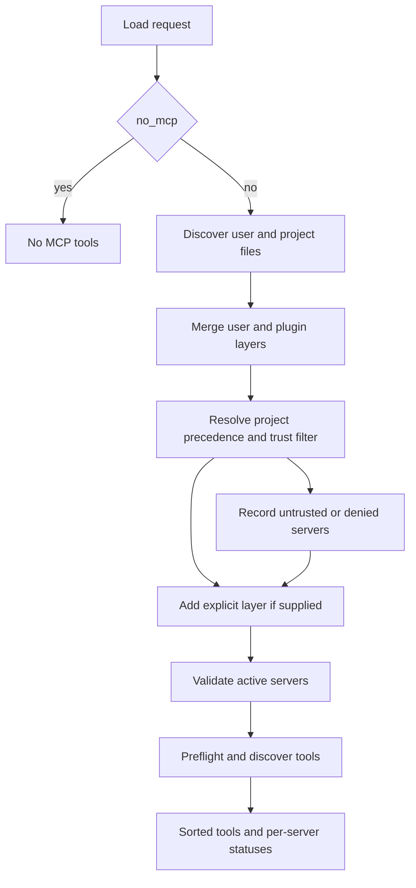
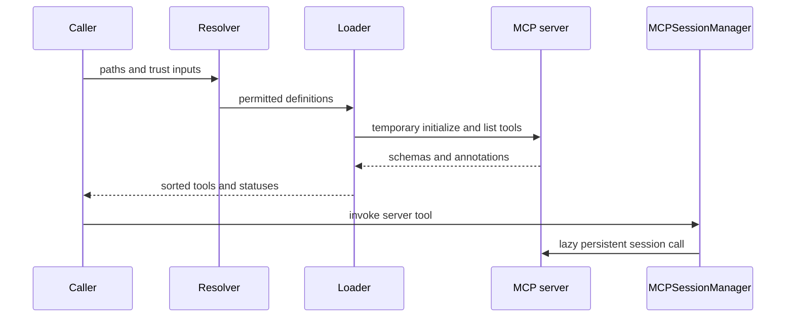
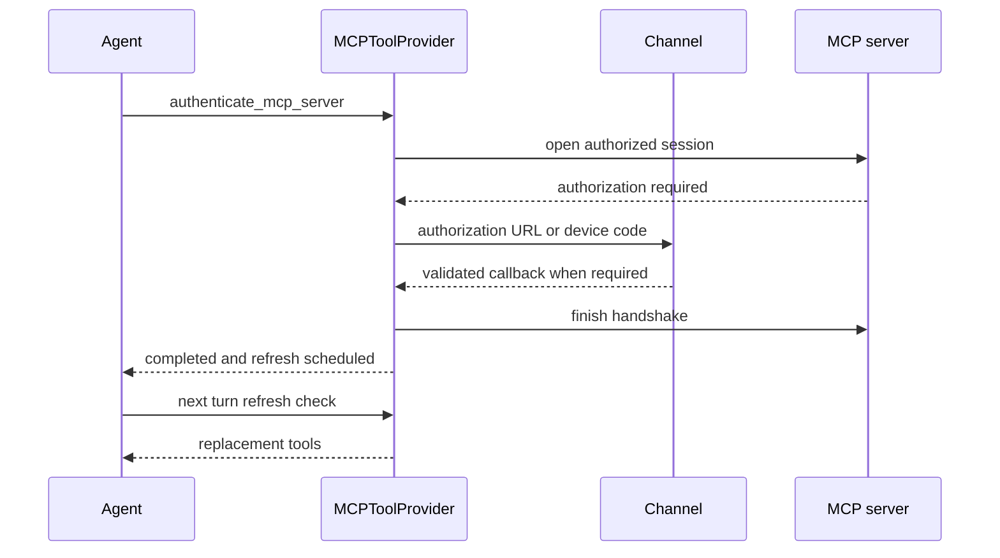
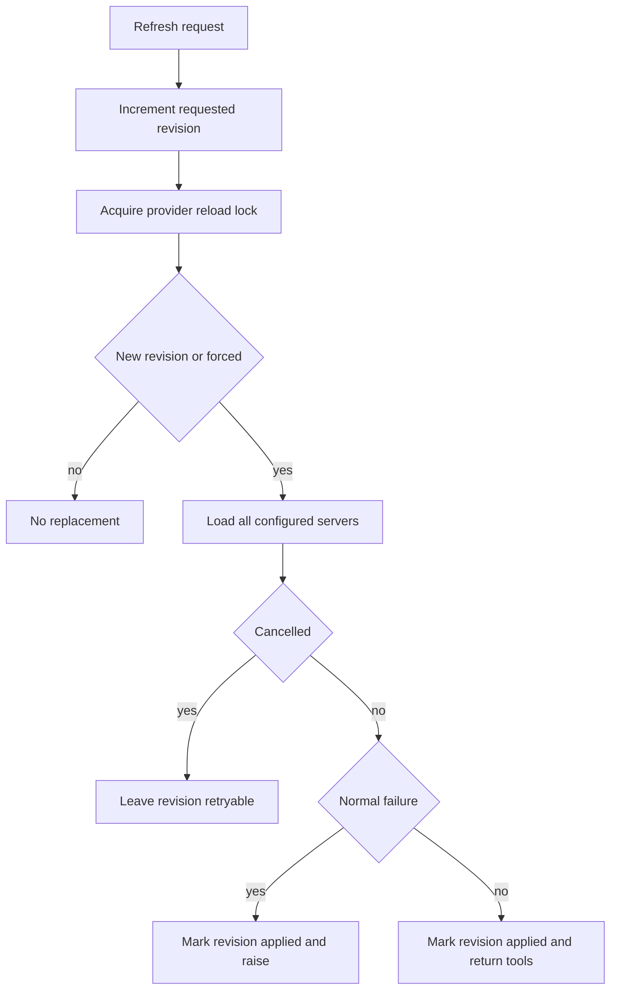

# MCP Integration

Model Context Protocol (MCP) adds tools supplied by local processes or remote services. dcode and Talon deliberately have **separate** MCP integrations: dcode composes layered configuration and treats project files as a trust decision, while Talon loads one operator-selected file and mediates management of that fixed path. Their approvals, credentials, and runtime sessions are not shared.

## Server document and validation

An MCP document has an `mcpServers` object. A server can use `type` or `transport`; omission means `http` when it has `url`, otherwise `stdio`. dcode accepts `stdio`, `http`, and `sse` and normalizes `streamable_http` / `streamable-http` to HTTP. Talon maps HTTP to the adapter's `streamable_http` transport and also accepts SSE. Remote entries need a URL; stdio entries need a command. `args`, `env`, and remote `headers` must have the expected string shapes.

Both integrations resolve `${VAR}` and `${VAR:-default}` in supported connection fields without mutating the raw definition. The `:-` default applies to an unset or empty variable; an unset non-default reference, malformed braced reference, or wrong field type fails rather than silently changing a command, endpoint, or header. Talon consults `TalonConfig.env` before the process environment, while dcode uses its active configuration environment.

`auth: oauth` is valid only for remote HTTP/SSE servers and cannot coexist with a static `Authorization` header. `allowedTools` and `disabledTools` are mutually exclusive non-empty lists of glob patterns. Filtering checks both the adapter's server-prefixed tool name and the original name.

## dcode discovery, precedence, and trust

`resolve_and_load_mcp_tools` is the main dcode loading entrypoint. `no_mcp=True` stops before discovery. Otherwise, usable user configuration is merged with plugin layers and trust-filtered project configuration; an optional explicit configuration is the highest-precedence layer. A structurally invalid explicit file is fatal. By contrast, the login resolver loads an explicit file alone, so `dcode mcp login` has an unambiguous target.

Project MCP is a security boundary: a checked-in definition can execute a local process, make remote requests, or interpolate a secret into a header. A project server therefore needs whole-project trust (`trust_project_mcp=True`) or a user-scoped approval matching both its project root and fingerprint. An explicit user denial wins even when the project is trusted. If the user trust policy cannot be read, saved approvals and whole-project trust fail closed; explicitly environment-enabled names can remain available. Precedence is resolved before this gate, so denying a winning override never resurrects an older approved definition.

Plugins are a separate extension boundary. Enabled plugin MCP servers are namespaced as `plugin__<plugin-id>__<server-name>` after plugin runtime values are substituted. Installing the plugin constitutes trust for bundled servers, but a user denial still wins and unreadable deny policy fails closed. Malformed plugin MCP declarations surface as configuration errors.

This shows dcode's precedence and trust decision before any permitted server is loaded.

### Login and credentials

Trust decides whether a definition may connect; OAuth decides how an allowed remote target authenticates. A credential does not approve a project definition, and trust does not authenticate an endpoint.

The UI-agnostic login resolver reports typed outcomes for explicit-load failure, no file, no usable configuration, unknown server, and invalid server definition. It also returns trust-policy, malformed-approval, legacy-policy, skipped-project-path, and discovered-load diagnostics. The CLI maps only no configuration to exit code 2; other resolution errors use exit code 1.

`dcode mcp login <server>` can use discovery-based OAuth for a remote HTTP or SSE server even when it lacks `auth: oauth`; it resolves environment references, applies provider policy, and opens a one-shot session to finish the handshake. It rejects stdio. Reauthorization hides an old token from the new attempt but preserves the stored credential if the new attempt aborts. At loading time, a configured OAuth server without a token is `unauthenticated`; a remote 401 Bearer protected-resource challenge also yields an unauthenticated status and login hint. A static `Authorization` header takes precedence over stored OAuth credentials.

## dcode: discovery sessions versus calls

This shows throwaway discovery separately from the lazy persistent session used for a real dcode tool call.

dcode preflights and discovers with bounded concurrency. Setup, discovery, and tool-conversion failures are isolated to their server, status order follows configuration order, and returned tools are sorted by name. Interpolation-related failure detail is redacted to avoid revealing resolved secrets.

Wrapped tool names are server-prefixed and retain MCP metadata including server and original tool name. Read-only treatment and Auto-mode approval require coherent explicit annotations: `readOnlyHint` must be true, `destructiveHint` must not be true, and all supplied hints must be boolean. Absent or malformed hints grant nothing.

`MCPSessionManager` owns runtime calls, not discovery. It lazily creates one initialized persistent session per server, refuses incompatible connection reconfiguration after sessions exist, and can invalidate a failed cached transport for later recreation. `cleanup()` rejects future creation and closes cached entries concurrently with a five-second per-server bound; ordinary teardown failures do not stop peers, while cancellation propagates. The dcode server graph owns a process-wide manager and cleans it up on shutdown; catalog and metadata callers clean up temporary managers in `finally`.

## Talon: one file, isolated server loading

Talon selects exactly one configuration: `DEEPAGENTS_TALON_MCP_CONFIG` from `TalonConfig.env` or the process environment, otherwise `~/.deepagents/.mcp.json`. A missing regular file means no MCP tools. It validates before connecting, then loads each server through `MultiServerMCPClient` with a 30-second timeout. Healthy servers remain usable when another server fails, tools are sorted by name, and server metadata distinguishes `ok`, `unauthenticated`, and `error` without attaching tools to a non-OK status. Talon also rejects dangerous stdio environment variables such as `LD_PRELOAD`, `PYTHONPATH`, and `BASH_ENV`.

Talon configures adapter interceptors for each loaded tool. OAuth prompts are bound to the exact LangGraph tool-call ID. Optional string-like arguments supplied as `""` are omitted, but required values and explicitly non-string fields are retained. A protocol `McpError` becomes a model-visible failed tool result containing only server name, tool name, error code, and message; unbounded server-controlled error `data` is withheld and cancellation still propagates.

Its OAuth files are separate from dcode's: `~/.deepagents/mcp-tokens/<server>-<url-hash>.json`, with a private directory, locked updates, and atomically written private token files. Refresh responses that omit a refresh token retain the stored refresh token.

## Talon authorization and reload lifecycle

`MCPToolProvider` adds management capabilities alongside loaded MCP tools. It exposes status when servers exist, exposes `authenticate_mcp_server` only when configured OAuth servers exist, and accepts only those configured names. Usable credentials return `already_authenticated` unless `reauthenticate=True`; completed authorization schedules a refresh. Configuration and reload tools schedule change for a later turn rather than changing the current turn's capabilities.

This shows authorization staying on the current Talon channel and new schemas becoming active only after refresh.

Browser URLs, callbacks, and device codes travel through the authorization channel rather than model-facing tool output. Without an interactive channel, authorization fails. Callback URLs must match a configured localhost callback endpoint and contain `code` and `state`. OAuth metadata and endpoint requests are constrained to safe public HTTPS, reject redirects, and validate issuer/endpoint relationships.

Refresh requests advance a revision. Reloads are lock-serialized and snapshot the requested revision: a request arriving during a load stays newer and receives a later reload. Cancellation leaves the revision retryable. A normal load failure marks that revision applied until another request arrives. The management tools return `available: after_successful_reload`; running work retains its original tools, and `get_agent_tools` can verify the later activation.

This shows the reload error paths that prevent a repeated failed revision while preserving a request that races with a load.

## Talon configuration management is mediated, not secret storage

`MCPConfigStore` is bound to the selected path and warns, rather than rejects, a path inside the agent workspace. This is not a confidentiality boundary: Talon's execution-capable default shell backend can read absolute paths. Redaction and the store mediate the management tools; they cannot protect a literal value from other agent capabilities. Prefer environment references or store credentials somewhere the Talon process cannot read.

`get_mcp_configuration` returns a process-local HMAC-derived revision and a redacted view. Literal strings are redacted except recognized transport/auth enum values and exact `${ENV_VAR}` references; references are never expanded. Unknown per-server fields are hidden from the management view and preserved on update.

`update_mcp_server` adds, replaces, or removes a complete server definition and requires the expected revision. `<redacted>` can restore a prior literal only at the same field. Before writing it validates the managed schema without resolving environment values or contacting a server, takes a bounded POSIX sidecar lock, rejects symlink and non-regular reads, and atomically replaces the file. It schedules refresh only after a successful write; conflict, malformed input, I/O, and malformed-file outcomes avoid leaking stored strings.

The runtime normally gates this write tool through its approval policy. If an update is executing without that approval and restores a `<redacted>` value, it may change only `allowedTools` or `disabledTools`; changing another managed setting is rejected because it could redirect a hidden credential to another command or URL. This protection applies to the approval state, not to the obsolete `DEEPAGENTS_TALON_MCP_CONFIG_AUTO_APPROVE` environment setting.

## Focused verification

The dcode tests cover login and OAuth/header exclusion, project fingerprint and deny policy, plugin composition, isolated server failure, annotation safety, and persistent-session cleanup/reconfiguration. Talon tests cover the standard path, timeout and status isolation, channel-bound OAuth and callbacks, protocol-error redaction, empty-string argument normalization, reload races and cancellation, redacted views, revision conflicts, symlink protection, atomic-write failure, lock contention, concurrent updates, and the approval-policy guard for restored secrets.

## Related pages

- [Code agent architecture](/openwiki/architecture/code-agent.md)
- [Permissions and human approval](/openwiki/concepts/permissions-hitl.md)
- [Talon runtime](/openwiki/integrations/talon.md)
- [Security operations](/openwiki/operations/security.md)
- [Run a dcode session](/openwiki/workflows/run-dcode-session.md)
