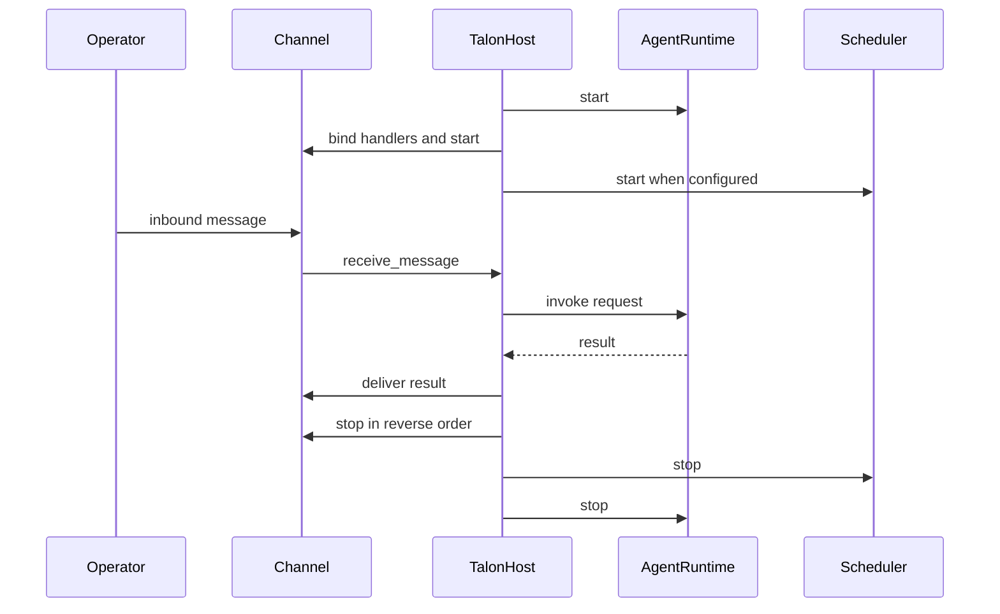
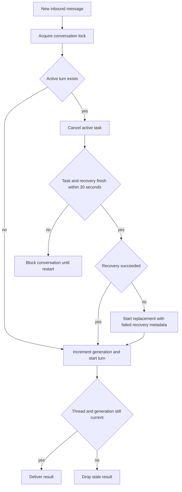
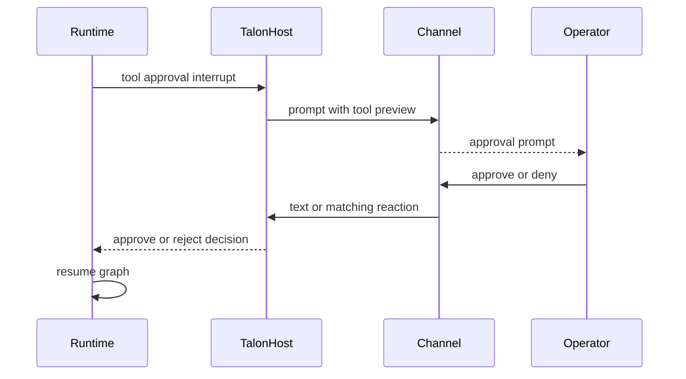
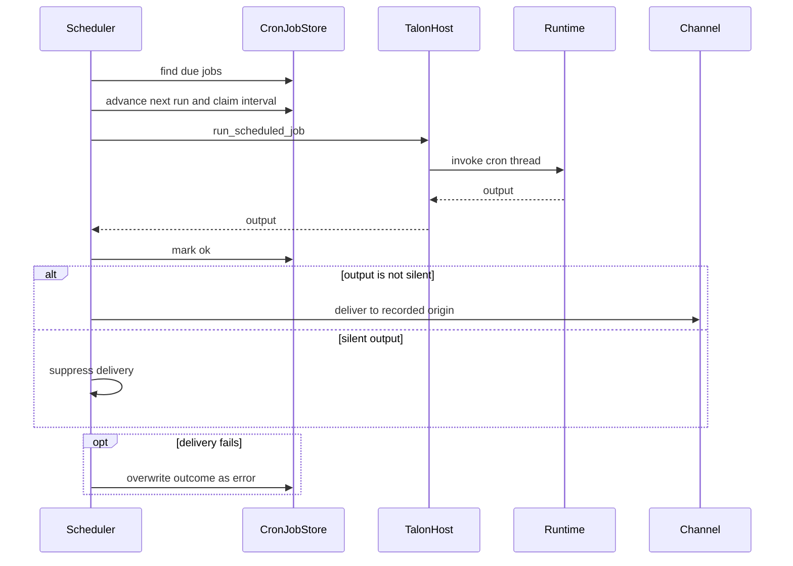

# Talon Runtime Host

> **Experimental; not a security boundary.** Talon is alpha software, subject to removal or change, and is not intended for production or enterprise use. It does **not** provide complete production HITL policy, channel-administrator controls, sandbox-backed execution isolation, or multi-tenant boundaries. Treat anyone with channel access as having direct access to the operator's agent, model credentials, MCP tools, and local-host resources. The project explicitly does not accept vulnerability reports for the absence of those known hardening features while Talon is experimental.

Talon (`libs/talon`) is the long-running process boundary for **one assistant**. `TalonHost` owns one `AgentRuntime`, zero or more channel adapters, and an optional cron scheduler in one asyncio event loop. The shipped adapters are WhatsApp, Telegram, and Discord; a channel event becomes a conversation-scoped agent request, and the host returns the current result to that channel conversation.

## Bootstrap, configuration, and ownership

Run `deepagents-talon` from `libs/talon`. `--whatsapp`, `--telegram`, and `--discord` attach adapters; `--once` only boots and tears down the host. The CLI creates the assistant cron store, ensures the home, cleans sensitive state, creates enabled channels, and selects the runtime. Without a configured model it uses `EchoAgentRuntime`, which echoes request text and is useful for lifecycle and channel-wiring checks. With a model, the CLI opens local SQLite checkpoints and an archive, wraps them in `ConversationSaver`, loads MCP tools, and constructs `DeepAgentRuntime`. It attaches `PersistentCronScheduler` only if there is at least one channel, because scheduled output needs a delivery route.

`DEEPAGENTS_TALON_ASSISTANT_ID` takes precedence over `AGENT_ASSISTANT_ID`, defaults to `default`, and must be a 1–128-character safe path segment. `DEEPAGENTS_TALON_MODEL` similarly takes precedence over `AGENT_MODEL`. State defaults to `~/.deepagents/<assistant-id>/`, or beneath `DEEPAGENTS_TALON_HOME`; `ensure_home()` creates the home, manifest, `agents/`, `cron/`, `channels/`, and `media/inbound/` directories with mode `0700`, and initializes `tools.json`.

`start()` ensures the home, starts the runtime, binds each channel's message handler and any supported reaction handler, starts channels, then starts the scheduler. A partial start unwinds already-started components in reverse order. `run_until_stopped()` installs `SIGINT`/`SIGTERM` where supported, and `request_shutdown()` sets the stop event. On normal teardown, the host cancels the background loop, all active work and pending approval/authorization futures, then stops channels in reverse order, the scheduler, and the runtime; component-stop failures are logged so later teardown still runs. Shutdown does not write interruption recovery state.

This sequence shows startup, an ordinary channel turn, and shutdown ownership.

## Channel turns, identity, cancellation, and reset

`ChannelAdapter` defines lifecycle, message registration, typing, status, text/media send, and edit operations. `ReactionChannelAdapter` is an optional capability. The host registers callbacks that route inbound messages to `receive_message` and supported reactions to `receive_reaction`.

Every channel turn is keyed by `provider:conversation-id`, **even for one channel**. That key is the LangGraph thread ID and the persisted-reset key; this deliberately means an upgrade from the older bare-key layout abandons existing bare-key checkpoints and reset counters rather than migrating them. `/help`, `/new`, `/stop`, `/reset-all-history`, and `/mcp-reload` are case-insensitive and accept an optional `@bot` suffix.

`/new` first cancels/recover the active agent work for the current thread, then atomically persists an incremented reset counter in `conversations.json`. Subsequent turns use `provider:conversation-id:talon-reset:<n>`, providing a fresh graph thread while retaining earlier history. `/reset-all-history` is available only when the runtime has a `ConversationSaver`: it cancels work, advances the counter, clears the current provider/chat archive and checkpoints, and rolls the counter back on clear failure. It does not delete cron jobs, memory files, media, traces, or backups.

A new ordinary message replaces, rather than queues behind, an active turn in the same conversation; independent conversations can proceed concurrently. Talon increments a generation, cancels the old task, and spends a single 30-second budget on cancellation plus `recover_interrupted()`. `DeepAgentRuntime` repairs pending tool calls in the latest committed state and appends an interruption marker. A response is delivered only when its generation and thread are still current, so stale output is dropped. A cancellation timeout blocks that conversation until Talon restarts. If recovery fails, the replacement is still allowed but carries `interruption_recovery: failed` metadata.

This is the per-conversation interrupt-and-continue path; the lock serializes control operations without preventing other conversations from running.

## Runtime graph and execution environment

The `AgentRuntime` protocol (`start`, `stop`, `invoke`, `recover_interrupted`) separates host orchestration from agent implementation. Talon provides `EchoAgentRuntime` and `DeepAgentRuntime`. On start, the Deep Agents runtime resolves subagents, loads the approval snapshot, and builds a graph with `create_deep_agent`. Its graph wiring includes the model, local backend, built-in and MCP tools, approval tools and policy, skills, memory, middleware, subagents, and checkpointer.

Each graph call supplies `configurable.thread_id` equal to the Talon conversation ID and a per-invocation recursion limit (default 500, overridable with `DEEPAGENTS_TALON_RECURSION_LIMIT`). Direct `DeepAgentRuntime` construction defaults to `InMemorySaver`; the standard model-backed CLI instead supplies persistent SQLite `ConversationSaver`. The runtime retries retryable provider, parsing, context-limit, and transport errors with exponential backoff capped at 10 seconds. If a graph returns no text, it sends configured continuation nudges and then a force-summary prompt; tool-approval resumption is limited to 50 rounds.

The default execution backend is a non-virtual `LocalShellBackend`, rooted at `DEEPAGENTS_TALON_WORKSPACE` or the current directory. Its child environment is allowlisted and scrubbed of secret and environment-hijack keys, including LangSmith/LangChain values, and gets a fixed safe `PATH`. This reduces unintended credential inheritance; it is **not** sandbox isolation.

The runtime scopes archive metadata, archive session ID, cron origin, authorization handler, and progress-message handler with context variables for each invocation. Archive tools appear only with `ConversationSaver`; cron tools appear only with a cron store and use the current request origin. Runtime MCP refresh and explicit reload build a replacement graph before replacing the active one, so an invalid reload leaves the old graph usable. Subagent definitions require explicit reload and activate on later turns; a running turn retains its captured graph and capabilities.

## Approvals, media, and MCP authorization

A tool approval interrupt is resolved by the runtime: cron or background/unattended turns are auto-denied with an explanatory tool result, and a channel turn without a handler is also denied rather than left blocked. For an attended channel turn, the host records a pending future under the agent conversation, sends tool names and argument previews, and accepts an `approve`/`deny` text decision (including thumbs emoji) only from the sender that started the turn. A reaction must additionally match the provider, conversation, and approval prompt message ID. The host marks an operator as approval-eligible only when the configured channel exposure recognizes that sender as an operator.

This diagram shows the attended channel path; cron, background, and handler-less paths reject instead of waiting.

The host refreshes typing indicators best-effort while a turn runs, can transcribe voice, and adds inbound-media context to model content. Result Markdown media references become channel attachments only when the resolved file stays under the configured outbound-media root; rejected or failed attachments are reflected in fallback text.

For channel MCP OAuth, Talon sends an authorization URL or device code directly to the originating chat. A callback is accepted only if provider, channel conversation, sender, active binding, and expiry match; callback values are intercepted before the model and redacted from logs/tracing paths. `DEEPAGENTS_TALON_MCP_CONFIG` selects an explicit config; otherwise Talon uses `~/.deepagents/.mcp.json`. `deepagents-talon mcp config` shows the path, `deepagents-talon mcp login <server>` supports terminal login, and `/mcp-reload` asks a reload-capable runtime to reload without an agent turn.

## History and scheduled delivery

The standard CLI stores checkpoints and a channel/chat-scoped archive in `checkpoints.sqlite`; scheduled runs do not enter that archive. Archive tools retain text, tool-call arguments, and message revisions, and are limited to the current channel/chat. `DEEPAGENTS_TALON_HISTORY_URI` can select SQLite, MongoDB, PostgreSQL, or one trusted operator-installed entry-point backend; all archives are namespaced by assistant ID while checkpoints stay local. The archive requires one writer per assistant. Optional vector search is enabled with `DEEPAGENTS_TALON_HISTORY_VECTOR_SEARCH=1`; a remote embedding adapter sends archived text and queries to its provider.

`CronJobStore` persists assistant-scoped jobs in `cron/jobs.json`, including schedule, origin, next-run state, and last outcome. It writes through a fsynced temporary file and atomic replacement with `0600` permissions. Agent-facing `create_job`, `list_jobs`, `edit_job`, and `remove_job` are origin-scoped. Supported schedules are minute-granularity relative one-shots/recurrences and explicit-timezone `at` or `daily at` wall-clock forms.

`PersistentCronScheduler` scans immediately and normally every 60 seconds, wakes early on stop, and logs a failed scan before retrying at the regular interval. For each due job it first uses `advance_next_run` to claim the interval, then invokes the host and records `ok` or `error`. `[SILENT]` at either trimmed end suppresses delivery. A delivery exception overwrites a successful generation outcome with `error`; one-shots and exhausted repeat limits become disabled when advancing the schedule.

This flow prevents a claimed interval from being rerun after a crash between generation and outcome recording, while retaining delivery failure as the final outcome.

## Observability and verification

Talon emits structured, redacted `talon_event` JSON logs. Redaction covers secret-bearing fields, URL query data, and direct conversation/message/sender IDs; stable short hashes can correlate protected IDs. `DEEPAGENTS_TALON_AGENT_ACTIVITY_LOGGING=true` additionally enables bounded, redacted local run, model-lifecycle, and tool previews, not hidden chain-of-thought. LangSmith tracing requires both truthy `LANGSMITH_TRACING` and `LANGSMITH_API_KEY` and includes assistant, conversation, and request metadata. Those traces, MCP services, history stores, and remote embedding services are outbound data surfaces.

Channel logger verbosity comes from `DEEPAGENTS_CODE_DEBUG` or `DEEPAGENTS_CODE_LOG_LEVEL`, whose accepted values are `DEBUG`, `INFO`, `WARNING`, `ERROR`, and `CRITICAL`. This is logging configuration, not access control.

Focused integration coverage verifies inbound channel-to-reply routing, persisted cron execution to its recorded origin, and an agent-created job that later fires. Host tests exercise lifecycle unwind/order, unconditional channel namespacing, commands and resets, cancellation timeout and degraded recovery, approval identity/reaction matching, attachment containment, and OAuth callback binding. Runtime tests cover graph wiring, retry/continuation, history, cron scoping, approval resume, backend environment scrubbing, and transactional reload behavior; scheduler tests cover interval claims, silence, and delivery-failure outcomes.

See [architecture overview](../architecture/overview.md), [permissions and HITL](../concepts/permissions-hitl.md), [state persistence](../concepts/state-persistence.md), [subagents and skills](../concepts/subagents-skills.md), [MCP integration](./mcp.md), and [security operations](../operations/security.md).
