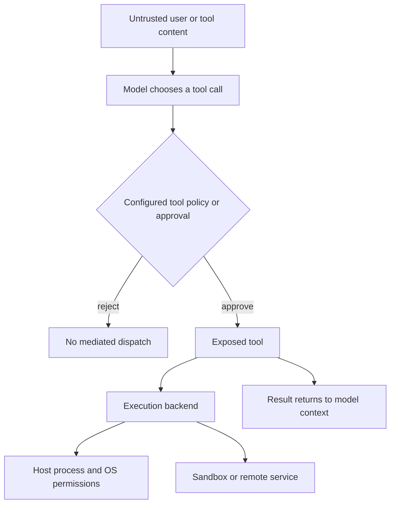
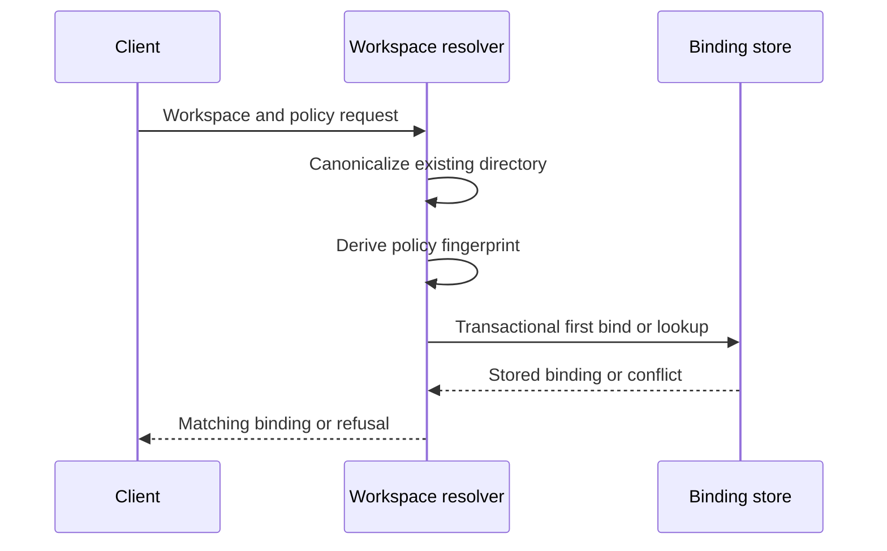

# Security Boundaries

## The boundary is the capability, not the prompt

Deep Agents follows a **trust the LLM** model: an agent can do what its exposed tools permit. Treat model-selected arguments and content returned by files, web search, shell commands, MCP servers, and channels as untrusted input. Prompts, redacted tool views, and warnings can improve review behavior, but they do not contain a process or prevent an accessible tool from disclosing data.

Put consequential authority at the appropriate layer:

- **Tool selection and approval** decide whether the agent may invoke a supported capability.
- **A sandbox, container, VM, or OS identity** decides what a permitted execution can reach.
- **Deployment controls** protect network listeners, databases/checkpoints, credentials, and local peers.
- **Channel exposure** decides who can cause an operator-authority agent to act.

The SDK is a library rather than an application security perimeter. The deployer must supply authentication, TLS, network placement, process identity, persistent-state protection, and a suitable execution backend.

This is the authority path: approval controls a mediated call, while the execution backend and OS controls determine the reachable environment. Results returning to the model are not thereby trusted.

Related: [code agent architecture](../architecture/code-agent.md), [backends](../concepts/backends.md), [permissions and HITL](../concepts/permissions-hitl.md), [MCP](../integrations/mcp.md), and [Talon](../integrations/talon.md).

## Filesystem policy is not shell containment

`FilesystemPermission` is ordered first-match policy for filesystem **read** and **write** tools. A matching rule allows, denies, or interrupts a tool call; patterns must be absolute and cannot contain `..` or `~`. Use anchored patterns for predictable bulk-operation interrupts.

Do not use these rules as a host confidentiality boundary. The middleware does not implement execute-tool permissions and refuses to load unscoped permissions with an execution-capable backend. A shell that runs as the same OS identity can still read an accessible absolute path. Use a sandbox, a separate low-privilege UID, or secret storage unavailable to that process when a secret must be protected from execution.

## dcode: project trust, server process, and workspace identity

dcode trusts its current directory by default and reads project artifacts before approval. Treat an untrusted checkout, its instructions, configuration, MCP definitions, extensions, hooks, and tool output as hostile influence. Use a remote sandbox before operating on an untrusted repository.

dcode starts its local server on loopback using noop authentication. Loopback exposure is useful only when hostile local processes cannot reach the server: it is not an authenticated API boundary. Run it under a dedicated account and protect its profile, state, token directories, and any persistent database with OS controls.

For server-hosted work, a thread is bound transactionally to a canonical, existing absolute workspace plus a policy fingerprint. A later request that substitutes the workspace or changes the policy conflicts, and runtime context must match the stored binding. This prevents accidental or client-driven thread migration; it does not protect against a process that can alter the binding database or host filesystem.

This flow makes the durable first binding authoritative rather than a later client claim.

### MCP configuration and dcode OAuth

dcode expands `${VAR}` and `${VAR:-default}` in MCP command, URL, arguments, environment, and headers. A malformed braced reference or an unset required variable fails resolution. Expansion is not secret mediation: the resolved value can be passed to a subprocess or remote MCP endpoint.

Its file-backed MCP OAuth store constrains token filenames, serializes read-modify-write mutations, and uses atomic replacement with owner-only file/directory hardening where supported. OAuth access and refresh tokens are nevertheless credential material on disk. Do not log token objects: their representation can include token strings. Treat failed permission hardening, a shared account, or host-level compromise as a credential-exposure concern and rotate credentials when indicated.

### Trace data is an outbound boundary

When dcode's LangSmith tracing can upload and secret redaction is enabled, it installs a secret anonymizer; if installation fails, it disables tracing rather than upload unredacted secrets. Turning redaction off deliberately permits the possibility of unredacted secret uploads. Keep secrets out of prompts, project files, and tool output even with redaction enabled, and validate the trace destination and retention policy independently.

## Talon: a local single-operator runtime

Talon is experimental alpha software, not a production or enterprise isolation boundary. It explicitly lacks multi-tenant isolation, sandbox-backed execution isolation, production-grade complete HITL enforcement, and channel administrator boundaries. A channel participant who can trigger it must be treated as holding the operator's effective agent, model, MCP, and local-host authority.

The default `DeepAgentRuntime` uses `LocalShellBackend` with `virtual_mode=False`. Talon disables inherited backend environment and constructs a filtered child environment with a fixed safe `PATH`; this reduces accidental propagation of secrets and loader/startup variables, but commands still execute on the local host with the Talon process's OS access. Assistant-home modes and state-path checks are hygiene measures, not an OS sandbox.

### Channels and approval mediation

The WhatsApp Python adapter uses a loopback Node bridge. Inbound exposure defaults to `self`; `allowlist` can limit trigger chats or mentions. `open` accepts arbitrary senders only after `DEEPAGENTS_TALON_WHATSAPP_OPEN_ACK=allow-arbitrary-senders` together with open exposure, and should not be used for an operator workstation.

Talon snapshots its exact-name approval policy for an invocation and rebuilds the graph when the stored policy changes before a later invocation. An enabled policy entry causes a human-in-the-loop interrupt. For a channel turn, the host sends the prompt back to the originating conversation and accepts an approval reply only from the sender that started the run. Cron, background delivery, and turns without an approval handler are auto-denied. This is useful mediation for configured tools, not a defense against a shell or another directly reachable capability.

### MCP configuration: warnings, approval, and actual boundaries

On POSIX, `MCPConfigStore` exposes a redacted read tool and a single-server update tool. It reads a regular non-symlink file, uses a process-keyed HMAC revision plus a lock to reject stale/busy updates, atomically writes validated settings, and asks the runtime to reload after a successful write. The update response means **available after successful reload**; a failed reload leaves saved edits inactive, and already-running turns/tasks retain their original tools.

The store's warning when an MCP configuration or credential path lies in the agent workspace is a **placement warning**, not an enforced denial. Its redaction, revision comparison, no-follow open, and `update_mcp_server` approval govern the mediated configuration path only. With Talon's default local shell, an agent can read or write any absolute path that the Talon OS identity can access, even if that path is outside the workspace. Moving a file outside the workspace removes a relative-path route, not shell access.

By default, MCP updates are approval-gated. Auto-approved updates that preserve hidden values with `<redacted>` are restricted so they cannot redirect a retained secret through changed command, transport, URL, or other managed settings; tool filters are the exception. This reduces risk on that tool path, but it is not a credential vault. Use `${ENV_VAR}` references for configuration values and keep the corresponding secret in an OS/key-management boundary inaccessible to the Talon process.

Talon stores MCP OAuth bearer and refresh tokens as cleartext local files with locking, atomic writes, and owner-only hardening. The project itself describes that hardening as insufficient against the default shell backend. OAuth links and callbacks handled through an interactive channel bypass model context and traces, but their local token storage remains subject to the host boundary.

### Talon telemetry and data egress

LangSmith tracing is opt-in in Talon. When enabled, Talon wraps runs with assistant, conversation, trigger, and source-message metadata; its security and data-lifecycle documentation states that serialized run inputs and outputs are sent to LangSmith. Model providers, MCP servers, search providers, and channel providers are additional outbound destinations for model-selected conversation-derived data. Evaluate their credentials, retention, and tenancy as separate trust boundaries.

## Operational checklist

1. Choose a sandbox/container/VM or dedicated low-privilege OS identity before opening an untrusted project or channel. Test the actual execution route, not only filesystem-tool permissions.
2. Treat dcode loopback as protected by local-host isolation. Do not run it beside untrusted local users/processes, and protect its persisted state and token material.
3. Keep automatic approval disabled unless the allowed capability and execution environment are deliberately narrow. Test denied, missing-handler, and scheduled approval paths.
4. For an existing dcode server thread, test a workspace switch and policy change and expect conflict. Include concurrent first-bind coverage in changes to workspace handling.
5. Prefer environment references in MCP configuration; do not put literal secrets in prompts, repositories, histories, configuration, or tool output. Rotate OAuth, provider, and channel credentials after suspected exposure.
6. For Talon, prefer `self` or a carefully scoped allowlist; test every channel as a non-operator. Do not mistake a config-path warning, redacted view, or chat approval for host isolation.
7. Audit tracing before enabling it: identify the provider/project, payload scope, redaction state, and retention. Disable or reconfigure it if that outbound path is not approved.
8. On suspected compromise, stop the runtime; revoke and rotate provider, MCP, and channel credentials; review trust and approval policy; inspect logs, state, checkpoints, and sandbox artifacts; then redeploy after retesting containment.

Focused regression coverage includes `libs/code/tests/unit_tests/test_workspace.py` for first-bind, conflict, and runtime-context invariants, and `libs/talon/tests/unit_tests/test_mcp_config.py` for redaction, revision, mode, and reload behavior.
