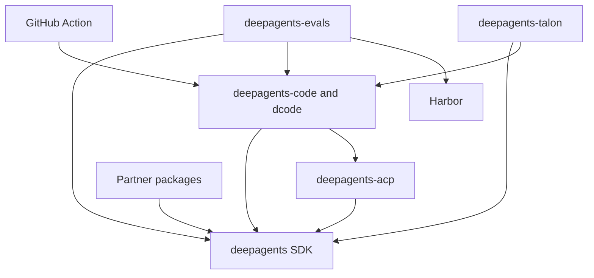

# Repository Quickstart

Deep Agents is an opinionated harness: `create_deep_agent()` configures harness behavior and delegates agent construction to LangChain's `create_agent()` on the LangGraph runtime. This page routes a maintainer to the owning boundary; use the package README, `Makefile`, and linked guide for detailed behavior.

## Choose an entry point

- **Try or change the prebuilt terminal agent:** install and run dcode.

  ```bash
  curl -LsSf https://langch.in/dcode | bash
  dcode
  ```

  `dcode` is the `deepagents-code` terminal coding product. For interactive, headless, resume, workspace, approval, MCP, sandbox, or ACP work, see [Run a dcode Session](./workflows/run-dcode-session.md).
- **Build a custom agent:** install with `uv add deepagents`, construct it with `create_deep_agent(model=..., tools=..., system_prompt=...)`, then follow [Build a Deep Agent](./workflows/build-a-deep-agent.md).
- **Change repository behavior:** locate the owning package below, work in that package's environment, and use its `Makefile`. Begin operational work with [Development, CI, and Releases](./operations/development.md).

## Package boundaries and dependency direction

`libs/` is a monorepo of independently versioned packages. There is no root `pyproject.toml`; every package carries its own `pyproject.toml`, `Makefile`, and README. Work in the package being changed. Local first-party dependencies are editable, so a sibling consumer sees source changes without a publication step.

| Boundary | Current released version | Ownership and public entry point | Read first |
| --- | --- | --- | --- |
| SDK | `deepagents` `0.7.13` | Reusable SDK: `create_deep_agent`, middleware, backends, profiles, skills, memory, and subagents. | [Build a Deep Agent](./workflows/build-a-deep-agent.md); [Architecture Overview](./architecture/overview.md) |
| Terminal coding product | `deepagents-code` `0.1.68` | dcode CLI/TUI, headless operation, sessions, configuration, tools, and workspace runtime. Both `dcode` and `deepagents-code` invoke `deepagents_code:cli_main`. | [Run a dcode Session](./workflows/run-dcode-session.md); [dcode Architecture](./architecture/code-agent.md) |
| Editor bridge | `deepagents-acp` `0.0.11` | Agent Client Protocol connector for running a Deep Agent in ACP-capable editors. dcode can expose its prebuilt coding agent with `dcode --acp`. | [ACP Integration](./integrations/acp.md) |
| Long-running host | `deepagents-talon` `0.0.8` | Experimental local host for channels, cron schedules, and agent lifecycle. Its command is `deepagents-talon`. | [Talon Runtime Host](./integrations/talon.md); [Security Boundaries](./operations/security.md) |
| Evaluation suite | `deepagents-evals` `0.0.1` | Behavioral evaluation suite and Harbor integration; its console script is `deepagents-evals`. It is not release-please managed. | [Run Evals](./workflows/run-evals.md); [Testing Guide](./testing/testing-guide.md) |
| Provider integrations | Daytona `0.0.8`, Modal `0.0.6`, Runloop `0.0.7`, Vercel `0.0.2`, QuickJS `0.3.7` | Separately released SDK integration boundaries for vendor or sandbox behavior. | [Sandbox and Partner Integrations](./integrations/sandbox-partners.md) |
| Workflow adapter | repository-root `action.yml` | Composite GitHub Action that installs and runs dcode in a workflow. | [GitHub Action Integration](./integrations/github-action.md) |

The declared dependency direction is intentional: `deepagents-code` pins `deepagents==0.7.13` and includes `deepagents-acp`; ACP depends on the SDK; evals depends on the SDK, dcode, and Harbor; Talon depends on the SDK and dcode; and every listed partner package depends on the SDK. Arrows below point from a consumer or adapter to the capability it uses, not to a runtime call sequence.



The diagram shows declared package and integration dependency direction.

## Know where runtime behavior belongs

The SDK is a three-layer stack:

- **LangGraph** owns runtime state, checkpoints, streaming, and interrupts.
- **LangChain `create_agent`** owns the agent abstraction: model, tools, middleware, and the model/tool loop.
- **Deep Agents** is the opinionated harness above `create_agent`, not another runtime. `create_deep_agent()` is the assembly point for the default middleware stack and for backends, subagents, skills, memory, and profiles.

Put generic agent policy in the SDK. Keep terminal presentation and dcode's client/server and workspace behavior in `libs/code`; ACP protocol translation in `libs/acp`; long-lived channel and cron host lifecycle in `libs/talon`; trajectory measurement in `libs/evals`; vendor behavior in its partner package; and workflow orchestration in `action.yml`. Use [Architecture Overview](./architecture/overview.md) for the system model and [Source Map and Change Routing](./architecture/source-map.md) to trace an observable behavior to an implementation seam and focused test.

## Route the task

| If you are changing… | Owning boundary | Read next |
| --- | --- | --- |
| SDK assembly, middleware, tools, backends, profiles, skills, memory, subagents, or approvals | `libs/deepagents/` | [Build a Deep Agent](./workflows/build-a-deep-agent.md); [SDK Middleware Stack](./architecture/middleware-stack.md); [Testing Guide](./testing/testing-guide.md) |
| dcode CLI/TUI, graph, client/server behavior, workspaces, configuration, persistence, streaming, or context offload | `libs/code/` | [Run a dcode Session](./workflows/run-dcode-session.md); [dcode Architecture](./architecture/code-agent.md); [State, Sessions, and Workspace Persistence](./concepts/state-persistence.md) |
| Editor ACP sessions, protocol behavior, or dcode ACP mode | `libs/acp/` or dcode's ACP integration | [ACP Integration](./integrations/acp.md); [Testing Guide](./testing/testing-guide.md) |
| Talon channels, schedules, host lifecycle, history, or MCP management | `libs/talon/` | [Talon Runtime Host](./integrations/talon.md); [Security Boundaries](./operations/security.md) |
| Evaluation coverage, repeated trials, or Harbor benchmarks | `libs/evals/` | [Run Evals](./workflows/run-evals.md); [Testing Guide](./testing/testing-guide.md) |
| MCP discovery, credentials, loading, reload, or failures | dcode or Talon integration boundary | [MCP Integration](./integrations/mcp.md); [Security Boundaries](./operations/security.md) |
| Sandbox provider, remote execution, or a provider integration | `libs/partners/<partner>/` | [Sandbox and Partner Integrations](./integrations/sandbox-partners.md); [Source Map](./architecture/source-map.md) |
| Action prompt, credentials, workspace, memory, skills, sandbox, MCP, or output behavior | `action.yml` plus invoked dcode flag | [GitHub Action Integration](./integrations/github-action.md); [Run a dcode Session](./workflows/run-dcode-session.md) |
| Dependencies, locks, versions, release metadata, CI, or package validation | Package manifest and release boundary | [Development, CI, and Releases](./operations/development.md) |

The root Action requires `prompt`, can cache persistent memory, and accepts model/provider credentials, working directory, skills, sandbox, MCP, interpreter, turn/timeout, and headless-output controls. Its `response`, `exit_code`, and memory-cache result are outputs. Treat an input or output as a workflow API: trace it to the dcode option it drives, and remember that a pinned `cli_version` can reject newer optional flags.

## Run the package-local loop

Use `uv` for interpreters, environments, and dependencies; do not use `pip`, Poetry, or Conda. `uv` provisions a suitable interpreter, so there is no repository-wide Python version to pin. The package `Makefile` is command authority: run `make help`, install intentionally with `uv sync --all-groups` (or the required group), and use `libs/` fan-out targets only for deliberate repository-wide checks.

Python compatibility is package-local: Deep Agents is `>=3.11,<4.0`, dcode is `>=3.12,<4.0`, ACP is `>=3.11`, evals is `>=3.12,<3.14`, Talon is `>=3.12`, and the five listed partners are `>=3.11,<4.0`. In particular, evals excludes Python 3.14.

For a focused change, identify the public boundary and state owner, edit the narrowest owning package, then update the nearest observable test. The SDK and dcode `make test` targets disable network sockets and their `integration_test` targets are separate. Evals' `make test` also disables sockets; `make evals MODEL=<id>` rejects a missing `MODEL` and runs the real-model suite in `tests/evals`, so it complements deterministic tests rather than replacing them.

## Operational caution: Talon

Talon is an experimental local runtime host, not a production security boundary. It does not implement complete HITL policy, channel administrator controls, sandbox-backed execution isolation, or multi-tenant boundaries. Treat channel access as direct access to the operator's agent, model credentials, MCP tools, and local resources. Read [Talon Runtime Host](./integrations/talon.md) and [Security Boundaries](./operations/security.md) before operating or extending it.

For broad navigation, start with [architecture](./architecture/overview.md), [workflows](./workflows/index.md), [integrations](./integrations/index.md), [operations](./operations/development.md), and [testing](./testing/testing-guide.md).
